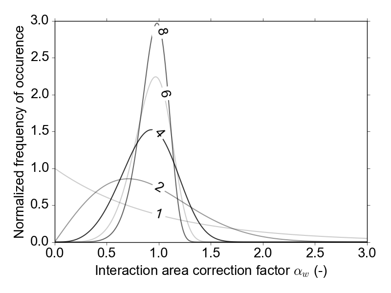
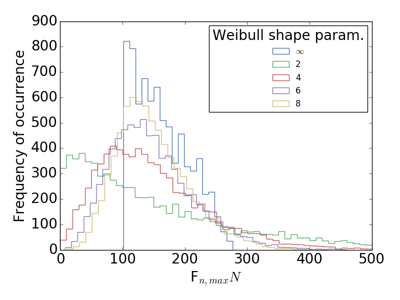

.. _acousticemissions:

=====================================
Simulating Acoustic Emissions in Yade
=====================================

*Suggested citation:*

Caulk, R. (2018), Stochastic Augmentation of the Discrete Element Method for Investigation of Tensile Rupture in Heterogeneous Rock. *Yade Technical Archive*. DOI 10.5281/zenodo.1202040. `download full text <https://www.yade-dem.org/w/images/f/f3/Caulkr_stochasticaugmentationofDEM-031618.pdf>`__

Summary
=======

This document briefly describes the simulation of acoustic emissions (AE) in Yade. Yade's clustered strain energy based AE simulation follows the methods introduced by [Hazzard2000]_ and [Hazzard2013]_. A validation of Yade's method and a look at the effect of rock heterogeneity on AE during tensile rock failure is discussed in detail in [Caulk2018]_.

Model description
=================

Numerical AE events are simlated by assuming each broken bond (or cluster of broken bonds) represents an event location. Additionally, the associated system strain energy change represents the event magnitude. Once a bond breaks, the strain energies :math:`(E_i)` are summed for all intact bonds within a predefined spatial radius:

.. math::

	E_i = \frac{1}{2}\Big(\frac{F_n^2}{k_n}+\frac{F_s^2}{k_s}\Big)

	E_o = \sum_i^N E_i

where :math:`F_n` :math:`F_s` and :math:`k_n`, :math:`k_s` are the normal and shear force (N) and stiffness (N/m) components of the interaction prior to failure, respectively. Yade's implementation uses the maximum change of strain energy surrounding each broken bond to estimate the moment magnitude of the AE. As soon as the bond breaks, the total strain energy (:math:`E_o=\sum_i^N E_i`) is computed for the radius (set by the user as no. of avg particle diameters, :math:`\lambda`. :math:`E_o` is used as the reference strain energy to compute :math:`\Delta E=E-E_o` during subsequent time steps. Finally, max(:math:`\Delta E`) is used in the empirical equation derived by [Scholz2003]_:

.. math::

	M_e = \frac{2}{3}\log \Delta E-3.2

Events are clustered if they occur within spatial and temporal windows of other events, similar to the approach presented by [Hazzard2000]_ and [Hazzard2013]_. The spatial window is simply the user defined :math:`\lambda` and the temporal window is computed as:

.. math::

	tsteps_{max} = int\Big(\frac{D_{avg} \lambda}{max(v_{p1},v_{p2})dt}\Big)
	
where :math:`D_{avg}` is the average diameter of the particles comprising the failed event (m), :math:`v_{p1}` and :math:`v_{p2}` are the P-Wave velocities (m/s) of the particle densities, and :math:`dt` is the time step of the simulation (seconds/time step). As shown in `fig-cluster`_, the final location of a clustered event is simply the average of the clustered event centroids. Here the updated reference strain energy is computed by adding the strain energy of the unique interaction surrounding the new broken bond to the original reference strain energy (:math:`E_o`):

- Original bond breaks, sum strain energy of broken bonds (:math:`N_{orig}`) within spatial window :math:`E_{orig,o} = \sum_{i=1}^{N_{orig}} E_i`
- New broken bond detected within spatial and temporal window of original bond break
- Update reference strain $E_o$ by adding unique bonds ($N_{new}$) within new broken bond spatial window :math:`E_{new,o} = E_{orig,o} + \sum_{i=1}^{N_{new}} E_i`

This method maintains a physical reference strain energy for the calculation of :math:`\Delta E = E - E_{new,o}` and depends strongly on the spatial window size. Ultimately, the clustering increases the number of larger events, which yields more comparable b-values of the Guttenberg Richter curve [Hazzard2013]_.

.. _fig-cluster:
.. figure:: fig/clusteredBonds2.*
	:scale: 45 %
	:align: center

	Example of clustered broken bonds (colored lines) and the final AE events (colored circles) with their event magnitudes. 

For a detailed look at the underlying algorithm, please refer to the `source code <https://github.com/yade/trunk/blob/master/pkg/dem/JointedCohesiveFrictionalPM.cpp>`__. 

Activating the algorithm within Yade
====================================

The simulation of AE is currently only available as part of Yade's Jointed Cohesive Frictional particle model :yref:`(JCFpm) <Law2_ScGeom_JCFpmPhys_JointedCOhesiveFrictionalPM>`. As such, your simulation needs to make use of :yref:`JCFpmMat <JCFpmMat>`, :yref:`JCFpmPhys <Ip2_JCFpmMat_JCFpmMat_JCFpmPhys>`, and :yref:`Law2_ScGeom_JCFpmPhys <Law2_ScGeom_JCFpmPhys_JointedCohesiveFrictionalPM>`

Your material assignment and engines list might look something like this:

.. code-block:: python

	JCFmat = O.materials.append(JCFpmMat(young=young, cohesion=cohesion,
 		density=density, frictionAngle=radians(finalFricDegree), 
		tensileStrength=sigmaT, poisson=poisson, label='JCFmat', 
		jointNormalStiffness=2.5e6,jointShearStiffness=1e6,jointCohesion=1e6)) 

	O.engines=[
			ForceResetter(),
			InsertionSortCollider([Bo1_Box_Aabb(),Bo1_Sphere_Aabb 
				,Bo1_Facet_Aabb()]),
		 	InteractionLoop(
				[Ig2_Sphere_Sphere_ScGeom(), Ig2_Facet_Sphere_ScGeom()],
				[Ip2_FrictMat_FrictMat_FrictPhys(), 
					Ip2_JCFpmMat_JCFpmMat_JCFpmPhys( \
						xSectionWeibullScaleParameter=xSectionScale, 
						xSectionWeibullShapeParameter=xSectionShape,
						weibullCutOffMin=weibullCutOffMin, 
						weibullCutOffMax=weibullCutOffMax)],
	  			[Law2_ScGeom_JCFpmPhys_JointedCohesiveFrictionalPM(\
					recordCracks=True, recordMoments=True,
					Key=identifier,label='interactionLaw'),
				Law2_ScGeom_FrictPhys_CundallStrack()]
 ),

    	    GlobalStiffnessTimeStepper(),
    	    VTKRecorder(recorders=['jcfpm','cracks','facets','moments'] \
				,Key=identifier,label='vtk'),
			NewtonIntegrator(damping=0.4)
	]

Most of this simply enables JCFpm as usual, the AE relevant commands are

.. code-block:: python

	Law2_ScGeom_JCFpmPhys_JointedCohesiveFrictionalPM(...  recordMoments=True ...)
	VTKRecorder(... recorders=[... 'moments' ...])

There are some other commands necessary for proper activation and use of the acoustic emissions algorithm:

:yref:`clusterMoments <Law2_ScGeom_JCFpmPhys_JointedCohesiveFrictionalPM.clusterMoments>` tells Yade to cluster new broken interactions within the user set spatial radius as described in modeldescription. This value is set to True by default. 

:yref:`momentRadiusFactor <Law2_ScGeom_JCFpmPhys_JointedCohesiveFrictionalPM.momentRadiusFactor>` is :math:`\lambda` from the above model description. The momentRadiusFactor changes the number of particle radii beyond the initial interaction that Yade computes the strain energy change as well asl the spatial window Yade uses to seek additional broken bonds for clustering. Set to 5 by default. 

:yref:`neverErase <Law2_ScGeom_JCFpmPhys_JointedCohesiveFrictionalPM.neverErase>` allows old interactions to be stored in memory despite no longer affecting the simulation. This value must be set to True for stable operation of Yade's AE cluster model.

Visualizing and post processing acoustic emissions
==================================================

AE are visualized and post processed in a similar manner to JCFpm cracks. As long as :yref:`recordMoments=True <Law2_ScGeom_JCFpmPhys_JointedCohesiveFrictionalPM.recordMoments>` and :yref:`recorder=['moments'] <VTKRecorder.recorders>`, the simulation will produce timestamped .vtu files for easy Paraview post processing. Within Paraview, the *AE can be filtered according to magnitude, number of constitiuent interactions, and event time*. `fig-aeexample_` shows AE collected during a three point bending test and filtered according to magnitude and time

.. _fig-aeexample:
.. figure:: fig/AEmagnitudeexample2.pdf
	:scale: 100%
	:align: center

	Example of AE simulated during three point bending test and filtered by magnitude and time.

Consideration of rock heterogeneity
===================================

[Caulk2018]_ shows that the spatial distribution of AE in Yade depends on the magnitude of rock model heterogeneity. [Caulk2018]_ hypothesizes that rock heterogeneity depends on the distribution of interacting grain edge lengths. In Yade's :yref:`JCFpm <Law2_ScGeom_JCFpmPhys_JointedCOhesiveFrictionalPM>`, the interaction strength of contacting particles depends on an interaction area :math:`A_{int}`. Thus, [Caulk2018]_  obtained a Weibull rock heterogeneity distribution by analyzing cathodoluminescent imagery of contacting rock grains. The disribution enables probabilistic generation of a correction factor, :math:`\alpha_w`, (shown below), which is used to control the DEM interaction area (:math:`A_{int}`):

.. math::
	
	A_{int} = \alpha_w \times \text{min}(R_a,R_b)^2\pi

The corresponding tensile strength distributions for various Weibull shape parameters are shown below. Note: a Weibull shape factor of :math:`\infty` is equivalent to the unaugmented JCFpm model.

In Yade, this is as simple as passing a Weibull shape parameter to :yref:`JCFpmPhys <Ip2_JCFpmMat_JCFpmMat_JCFpmPhys>`::

	Ip2_JCFpmMat_JCFpmMat_JCFpmPhys(
		xSectionWeibullScaleParameter=xSectionScale,
 		xSectionWeibullShapeParameter=xSectionShape,
		weibullCutOffMin=weibullCutOffMin, 
		weibullCutOffMax=weibullCutOffMax)

where the :yref:`xSectionWeibullShapeParameter <Ip2_JCFpmMat_JCFpmMat_JCFpmPhys.xSectionWeibullShapeParameter>` is the desired Weibull shape parameter. The scale parameter can be assigned in similar fashion. If you want to control the minimum allowable correction factor, you can feed it :yref:`weibullCutoffMin <Ip2_JCFpmMat_JCFpmMat_JCFpmPhys.weibullCutOffMin>`. The maximum correction factor can be controlled in similar fashion.

|pic1| |pic2|

*Weibull distributions for varying shape parameters used to generate :math:`\alpha_w` (left).Maximum DEM particle bond tensile strength distributions for varying Weibull shape parameters (right).

