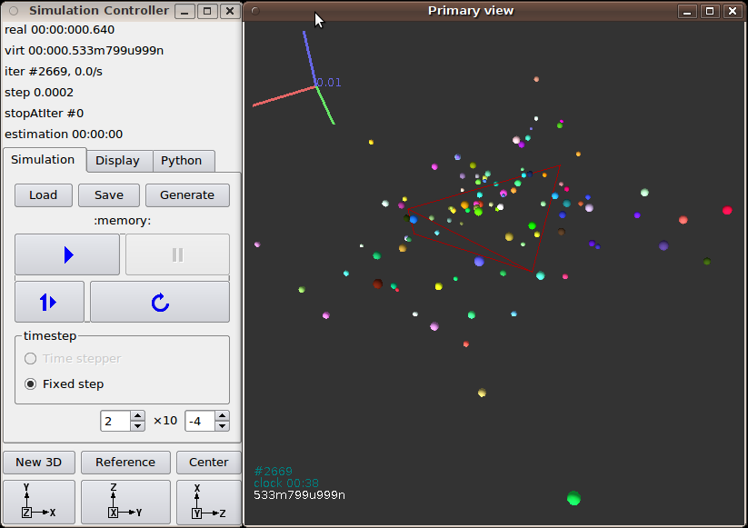

###############
Introduction
###############

Getting started
===============

.. ipython::
	:suppress:

	In [1]: from yade import *

	In [7]: O.reset()

Before you start moving around in Yade, you should have some prior knowledge.

* Basics of command line in your Linux system are necessary for running yade. Look on the web for tutorials.
* Python language; we recommend the official `Python tutorial <http://docs.python.org/tutorial>`_. Reading further documents on the topis, such as `Dive into Python <http://diveintopython.org/>`_ will certainly not hurt either.

You are advised to try all commands described yourself. Don't be afraid to experiment.

Starting yade
-------------

Yade is being run primarily from terminal; the name of command is ``yade``. [#f1]_ (In case you did not install from package, you might need to give specific path to the command [#fcmd]_ )::

	\$ yade
	Welcome to Yade bzr1984
	TCP python prompt on localhost:9001, auth cookie `sdksuy'
	TCP info provider on localhost:21000
	[[ ^L clears screen, ^U kills line. F12 controller, F11 3d view, F10 both, F9 generator, F8 plot. ]]
	Yade [1]:

These initial lines give you some information about

* version (``bzr1984``); always state this version you use if you seek help in the community or report bug;
* some information for :ref:`remoteaccess`, which you are unlikely to need now;
* basic help for the command-line that just appeared (``Yade [1]:``).

Type ``quit()``, ``exit()`` or simply press ``^D`` to quit Yade. 

The command-line is `ipython <http://ipython.scipy.org>`_, python shell with enhanced interactive capabilities; it features persistent history (remembers commands from your last sessions), searching and so on. See ipython's documentation for more details.

Typically, you will not type Yade commands by hand, but use *scripts*, python programs describing and running your simulations. Let us take the most simple script that will just print "Hello world!"::

	print "Hello world!"

Saving such script as ``hello.py``, it can be given as argument to yade::

	\$ yade hello.py
	Welcome to Yade bzr1986
	TCP python prompt on localhost:9001, auth cookie `askcsu'
	TCP info provider on localhost:21000
	Running script hello.py                                           ## the script is being run
	Hello world!                                                      ## output from the script
	[[ ^L clears screen, ^U kills line. F12 controller, F11 3d view, F10 both, F9 generator, F8 plot. ]]
	Yade [1]:

Yade will run the script and then drop to the command-line again. [#f2]_ If you want Yade to quit immediately after running the script, use the ``-x`` switch::

	\$ yade -x script.py

There is more command-line options than just ``-x``, run ``yade -h`` to see all of them.

	Options:
	  --version             show program's version number and exit
	  -h, --help            show this help message and exit
	  -j THREADS, --threads=THREADS
	                        Number of OpenMP threads to run; defaults to 1.
	                        Equivalent to setting OMP_NUM_THREADS environment
	                        variable.
	  --cores=CORES         Set number of OpenMP threads (as \-\-threads) and in
	                        addition set affinity of threads to the cores given.
	  --update              Update deprecated class names in given script(s) using
	                        text search & replace. Changed files will be backed up
	                        with ~ suffix. Exit when done without running any
	                        simulation.
	  --nice=NICE           Increase nice level (i.e. decrease priority) by given
	                        number.
	  -x                    Exit when the script finishes
	  -n                    Run without graphical interface (equivalent to
	                        unsetting the DISPLAY environment variable)
	  --generate-manpage=FILE
	                        Generate man page documenting this program and exit
	  --rebuild             Re-run build in the source directory, then run the
	                        updated yade with the same command line except
	                        \-\-rebuild. The build profile for this build (deb)
	                        and its stored parameters will be used.
	  --test                Run regression test suite and exit; the exists status
	                        is 0 if all tests pass, 1 if a test fails and 2 for an
	                        unspecified exception.
	  --debug               Run the debug build, if available.
	  --checks              Run a series of user-defined check tests as described
	                        in /build/buildd/yade-
	                        daily-1+3021+27~lucid1/scripts/test/checks/README
	  --performance         Starts a test to measure the productivity
	  --no-gdb              Do not show backtrace when yade crashes (only
	                        effective with \-\-debug).

.. rubric:: Footnotes

.. [#f1] The executable name can carry a suffix, such as version number (``yade-0.20``), depending on compilation options. Packaged versions on Debian systems always provide the plain ``yade`` alias, by default pointing to latest stable version (or latest snapshot, if no stable version is installed). You can use ``update-alternatives`` to change this.
.. [#fcmd] In general, Unix *shell* (command line) has environment variable ``PATH`` defined, which determines directories searched for executable files if you give name of the file without path. Typically, \$PATH contains ``/usr/bin/``, ``/usr/local/bin``, ``/bin`` and others; you can inspect your ``PATH`` by typing ``echo \$PATH`` in the shell (directories are separated by ``:``).

	If Yade executable is not in directory contained in ``PATH``, you have to specify it by hand, i.e. by typing the path in front of the filename, such as in ``/home/user/bin/yade`` and similar. You can also navigate to the directory itself (``cd ~/bin/yade``, where ``~`` is replaced by your home directory automatically) and type ``./yade`` then (the ``.`` is the current directory, so ``./`` specifies that the file is to be found in the current directory).

	To save typing, you can add the directory where Yade is installed to your ``PATH``, typically by editing ``~/.profile`` (in normal cases automatically executed when shell starts up) file adding line like ``export PATH=/home/user/bin:\$PATH``. You can also define an *alias* by saying ``alias yade="/home/users/bin/yade"`` in that file.

	Details depend on what shell you use (bash, zsh, tcsh, …) and you will find more information in introductory material on Linux/Unix.

.. [#f2] Plain Python interpreter exits once it finishes running the script. The reason why Yade does the contrary is that most of the time script only sets up simulation and lets it run; since computation typically runs in background thread, the script is technically finished, but the computation is running.

Creating simulation
--------------------
To create simulation, one can either use a specialized class of type :yref:`FileGenerator` to create full scene, possibly receiving some parameters. Generators are written in c++ and their role is limited to well-defined scenarios. For instance, to create triaxial test scene:

.. ipython::

	In [1]: TriaxialTest(numberOfGrains=200).load()

	In [2]: len(O.bodies)
	1006

Generators are regular yade objects that support attribute access.

It is also possible to construct the scene by a python script; this gives much more flexibility
and speed of development and is the recommended way to create simulation. Yade provides modules
for streamlined body construction, import of geometries from files and reuse of common code.
Since this topic is more involved, it is explained in the *User's manual*.

.. ipython::
	:suppress:

	In [7]: O.reset()

Running simulation
------------------

As explained above, the loop consists in running defined sequence of engines. Step number can be queried by ``O.iter`` and advancing by one step is done by ``O.step()``. Every step advances *virtual time* by current timestep, ``O.dt``:

.. ipython::

	In [1]: O.iter

	In [1]: O.time

	In [1]: O.dt=1e-4

	In [1]: O.step()

	In [1]: O.iter
	1

	In [1]: O.time
	1e-4

Normal simulations, however, are run continuously. Starting/stopping the loop is done by ``O.run()`` and ``O.pause()``; note that ``O.run()`` returns control to Python and the simulation runs in background; if you want to wait for it finish, use ``O.wait()``. Fixed number of steps can be run with ``O.run(1000)``, ``O.run(1000,True)`` will run and wait. To stop at absolute step number, ``O.stopAtIter`` can be set and ``O.run()`` called normally.

.. ipython::

	In [1]: O.run()

	In [1]: O.pause()

	In [1]: O.iter
	104587

	In [1]: O.run(100000,True)

	In [1]: O.iter
	204587

	In [1]: O.stopAtIter=500000

	In [1]: O.wait()

	In [1]: O.iter
	500000

Saving and loading
------------------
Simulation can be saved at any point to (optionally compressed) XML file. With some limitations,
it is generally possible to load the XML later and resume the simulation as if it were not
interrupted. Note that since XML is merely readable dump of Yade's internal objects, it might not
(probably will not) open with different Yade version.

.. ipython::

	In [1]: O.save('/tmp/a.xml.bz2')

	In [2]: O.reload() 

	@suppress
	In [4]: O.save('/tmp/another.xml.bz2')

	In [3]: O.load('/tmp/another.xml.bz2')

The principal use of saving the simulation to XML is to use it as temporary in-memory storage
for checkpoints in simulation, e.g. for reloading the initial state and running again with
different parameters (think tension/compression test, where each begins from the same virgin
state). The functions ``O.saveTmp()`` and ``O.loadTmp()`` can be optionally given a slot name,
under which they will be found in memory:

.. ipython::

	In [1]: O.saveTmp()

	In [1]: O.loadTmp()

	In [1]: O.saveTmp('init') ## named memory slot

	In [1]: O.loadTmp('init')

Simulation can be reset to empty state by ``O.reset()``.

It can be sometimes useful to run different simulation, while the original one is temporarily
suspended, e.g. when dynamically creating packing. ``O.switchWorld()``  toggles between the
primary and secondary simulation.

Graphical interface
--------------------
Yade can be optionally compiled with qt4-based graphical interface. It can be started by pressing ``F12`` in the command-line, and also is started automatically when running a script.

The windows with buttons is called ``Controller`` (can be invoked by ``yade.qt.Controller()`` from python):

#. The *Simulation* tab is mostly self-explanatory, and permits basic simulation control.
#. The *Display* tab has various rendering-related options, which apply to all opened views (they can be zero or more, new one is opened by the *New 3D* button).
#. The *Python* tab has only a simple text entry area; it can be useful to enter python commands while the command-line is blocked by running script, for instance.

3d views can be controlled using mouse and keyboard shortcuts; help is displayed if you press the ``h`` key while in the 3d view. Note that having the 3d view open can slow down running simulation significantly, it is meant only for quickly checking whether the simulation runs smoothly. Advanced post-processing is described in dedicated section.

Architecture overview
======================

.. ipython::
	:suppress:

	In [12]: from yade import *

	In [1]: from yade import utils

	In [7]: O.reset()

In the following, a high-level overview of Yade architecture will be given. As many of the features are directly represented in simulation scripts, which are written in Python, being familiar with this language will help you follow the examples. For the rest, this knowledge is not strictly necessary and you can ignore code examples.

Data and functions
-------------------

To assure flexibility of software design, yade makes clear distinction of 2 families of classes: *data* components and *functional* components. The former only store data without providing functionality, while the latter define functions operating on the data. In programming, this is known as *visitor* pattern (as functional components "visit" the data, without being bound to them explicitly).

Entire simulation, i.e. both data and functions, are stored in a single ``Scene`` object. It is accessible through the :yref:`Omega` class in python (a singleton), which is by default stored in the ``O`` global variable:

.. ipython::

	Yade [1]: O.bodies       # some data components

	Yade [2]: len(O.bodies)  # there are no bodies as of yet

	Yade [3]: O.engines      # functional components, empty at the moment

Data components
^^^^^^^^^^^^^^^

Bodies
"""""""

Yade simulation (class ``Scene``, but hidden inside :yref:`Omega` in Python) is represented by :yref:`Bodies<Body>`, their :yref:`Interactions<Interaction>` and resultant generalized :yref:`forces<Omega.forces>` (all stored internally in special containers).

Each :yref:`Body` comprises the following:

:yref:`Shape`
	represents particle's geometry (neutral with regards to its spatial orientation), such as :yref:`Sphere`, :yref:`Facet` or inifinite :yref:`Wall`; it usually does not change during simulation.
:yref:`Material`
	stores characteristics pertaining to mechanical behavior, such as Young's modulus or density, which are independent on particle's shape and dimensions; usually constant, might be shared amongst multiple bodies.
:yref:`State`
	contains state variable variables, in particular spatial :yref:`position<State::pos>` and :yref:`orientation<State::ori>`, :yref:`linear<State::vel>` and :yref:`angular<State::angVel>` velocity, :yref:`linear<State::accel>` and :yref:`angular<State::angAccel>` accelerator; it is updated by the :yref:`integrator<NewtonIntegrator>` at every step.

	Derived classes can hold additional data, e.g. :yref:`averaged damage<Cpm::normDmg>`.
:yref:`Bound`
	is used for approximate ("pass 1") contact detection; updated as necessary following body's motion. Currently, :yref:`Aabb` is used most often as :yref:`Bound`. Some bodies may have no :yref:`Bound`, in which case they are exempt from contact detection.

(In addition to these 4 components, bodies have several more minor data associated, such as :yref:`Body::id` or :yref:`Body::mask`.)

All these four properties can be of different types, derived from their respective base types. Yade frequently makes decisions about computation based on those types: :yref:`Sphere` + :yref:`Sphere` collision has to be treated differently than :yref:`Facet` + :yref:`Sphere` collision. Objects making those decisions are called :yref:`Dispatcher`'s and are essential to understand Yade's functioning; they are discussed below. 

Explicitly assigning all 4 properties to each particle by hand would be not practical; there are utility functions defined to create them with all necessary ingredients. For example, we can create sphere particle using :yref:`yade.utils.sphere`:

.. ipython::
	
   In [3]: s=utils.sphere(center=[0,0,0],radius=1)

   In [5]: s.shape, s.state, s.mat, s.bound

   In [6]: s.state.pos

   In [7]: s.shape.radius

We see that a sphere with material of type :yref:`FrictMat` (default, unless you provide another :yref:`Material`) and bounding volume of type :yref:`Aabb` (axis-aligned bounding box) was created. Its position is at origin and its radius is 1.0. Finally, this object can be inserted into the simulation; and we can insert yet one sphere as well.

.. ipython::

	In [1]: O.bodies.append(s)
	0

	In [2]: O.bodies.append(utils.sphere([0,0,2],.5))
	1

In each case, return value is :yref:`Body.id` of the body inserted. 

Since till now the simulation was empty, its id is 0 for the first sphere and 1 for the second one. Saving the id value is not necessary, unless you want access this particular body later; it is remembered internally in :yref:`Body` itself. You can address bodies by their id:

.. ipython::

	In [1]: O.bodies[1].state.pos
	<Body instance at 0x92e8f60>

	In [2]: O.bodies[100]
	IndexError: Body id out of range.

Adding the same body twice is, for reasons of the id uniqueness, not allowed:

.. ipython::
	
	In [1]: O.bodies.append(s)

Bodies can be iterated over using standard python iteration syntax:

.. ipython::

	In [1]: for b in O.bodies:
	   ...:    print b.id,b.shape.radius
	   ...:
	0 1.0
	1 0.5

Interactions
"""""""""""""""

:yref:`Interactions<Interaction>` are always between pair of bodies; usually, they are created by the collider based on spatial proximity; they can, however, be created explicitly and exist independently of distance. Each interaction has 2 components:

:yref:`IGeom`
	holding geometrical configuration of the two particles in collision; it is updated automatically as the particles in question move and can be queried for various geometrical characteristics, such as penetration distance or shear strain.
	
	Based on combination of types of :yref:`Shapes<Shape>` of the particles, there might be different storage requirements; for that reason, a number of derived classes exists, e.g. for representing geometry of contact between :yref:`Sphere+Sphere<Dem3DofGeom_SphereSphere>`, :yref:`Facet+Sphere<Dem3DofGeom_FacetSphere>` etc.
:yref:`IPhys`
	representing non-geometrical features of the interaction; some are computed from :yref:`Materials<Material>` of the particles in contact using some averaging algorithm (such as contact stiffness from Young's moduli of particles), others might be internal variables like damage.

Suppose now interactions have been already created. We can access them by the id pair:

.. ipython::
	:suppress:

	In [1]: O.engines=[InteractionLoop([Ig2_Sphere_Sphere_Dem3DofGeom()],[Ip2_FrictMat_FrictMat_FrictPhys()],[])]

	In [2]: utils.createInteraction(0,1);

.. ipython::

	In [1]: O.interactions[0,1]
	<Interaction instance at 0x93f9528>

	In [2]: O.interactions[1,0]     # order of ids is not important

	In [2]: i=O.interactions[0,1]
	
	In [3]: i.id1,i.id2
	(0, 1)

	In [4]: i.geom
	<Dem3Dof_Sphere_Sphere instance at 0x9403838>

	In [5]: i.phys
	<ElasticContactInteraction instance at 0x94038d0>

	In [6]: O.interactions[100,10111]
	ValueError: No such interaction

Generalized forces
""""""""""""""""""""

Generalized forces include force, torque and forced displacement and rotation; they are stored only temporarliy, during one computation step, and reset to zero afterwards. For reasons of parallel computation, they work as accumulators, i.e. only can be added to, read and reset.

.. ipython::

	Yade [1]: O.forces.f(0)

	Yade [2]: O.forces.addF(0,Vector3(1,2,3))

	Yade [3]: O.forces.f(0)

	@suppress
	In [7]: O.reset()

You will only rarely modify forces from Python; it is usually done in c++ code and relevant documentation can be found in the Programmer's manual.

.. _function-components:

Function components
^^^^^^^^^^^^^^^^^^^^

In a typical DEM simulation, the following sequence is run repeatedly:

* reset forces on bodies from previous step
* approximate collision detection (pass 1)
* detect exact collisions of bodies, update interactions as necessary
* solve interactions, applying forces on bodies
* apply other external conditions (gravity, for instance).
* change position of bodies based on forces, by integrating motion equations.

.. _img-yade-iter-loop:
.. figure:: fig/yade-iter-loop.*

	Typical simulation loop; each step begins at body-cented bit at 11 o'clock, continues with interaction bit, force application bit, miscillanea and ends with time update.

Each of these actions is represented by an :yref:`Engine<Engine>`, functional element of simulation. The sequence of engines is called *simulation loop*.

.. _sect-simulation-loop:

Engines
"""""""""

Simulation loop, shown at img. img-yade-iter-loop_, can be described as follows in Python (details will be explained later); each of the ``O.engine`` items is instance of a type deriving from :yref:`Engine`:

.. code-block:: python
 
	O.engines=[
		# reset forces
		ForceResetter(),
		# approximate collision detection, create interactions
		InsertionSortCollider([Bo1_Sphere_Aabb(),Bo1_Facet_Aabb()]),
		# handle interactions
		InteractionLoop(
			[Ig2_Sphere_Sphere_Dem3DofGeom(),Ig2_Facet_Sphere_Dem3DofGeom()],
			[Ip2_FrictMat_FrictMat_FrictPhys()],
			[Law2_Dem3Dof_Elastic_Elastic()],
		),
		# apply other conditions
		GravityEngine(gravity=(0,0,-9.81)),
		# update positions using Newton's equations
		NewtonIntegrator()
	]

There are 3 fundamental types of Engines:

:yref:`GlobalEngines<GlobalEngine>`
	operating on the whole simulation (e.g. :yref:`GravityEngine` looping over all bodies and applying force based on their mass)

:yref:`PartialEngine<PartialEngine>`
	operating only on some pre-selected bodies (e.g. :yref:`ForceEngine` applying constant force to some bodies)

:yref:`Dispatchers<Dispatcher>`
	do not perform any computation themselves; they merely call other functions, represented by function objects, :yref:`Functors<Functor>`. Each functor is specialized, able to handle certain object types, and will be dispatched if such obejct is treated by the dispatcher. 

.. _dispatchers-and-functors:

Dispatchers and functors
"""""""""""""""""""""""""

For approximate collision detection (pass 1), we want to compute :yref:`bounds<Body::bound>` for all :yref:`bodies<Body>` in the simulation; suppose we want bound of type :yref:`axis-aligned bounding box`. Since the exact algorithm is different depending on particular :yref:`shape<Body::shape>`, we need to provide functors for handling all specific cases. The line::

	InsertionSortCollider([Bo1_Sphere_Aabb(),Bo1_Facet_Aabb()])

creates :yref:`InsertionSortCollider` (it internally uses :yref:`BoundDispatcher`, but that is a detail). It traverses all bodies and will, based on :yref:`shape<Shape>` type of each :yref:`body<Body>`, dispatch one of the functors to create/update :yref:`bound<Bound>` for that particular body. In the case shown, it has 2 functors, one handling :yref:`spheres<Sphere>`, another :yref:`facets<Facet>`. 
	
The name is composed from several parts: ``Bo`` (functor creating :yref:`Bound`), which accepts ``1`` type :yref:`Sphere` and creates an :yref:`Aabb` (axis-aligned bounding box; it is derived from :yref:`Bound`). The :yref:`Aabb` objects are used by :yref:`InsertionSortCollider` itself. All ``Bo1`` functors derive from :yref:`BoundFunctor`.

The next part, reading

.. code-block:: python

	InteractionLoop(
		[Ig2_Sphere_Sphere_Dem3DofGeom(),Ig2_Facet_Sphere_Dem3DofGeom()],
		[Ip2_FrictMat_FrictMat_FrictPhys()],
		[Law2_Dem3Dof_Elastic_Elastic()],
	),

hides 3 internal dispatchers within the :yref:`InteractionLoop` engine; they all operate on interactions and are, for performance reasons, put together:

:yref:`IGeomDispatcher`
	uses the first set of functors (``Ig2``), which are dispatched based on combination of ``2`` :yref:`Shapes<Shapes>` objects. Dispatched functor resolves exact collision configuration and creates :yref:`IGeom<Interaction::geom>` (whence ``Ig`` in the name) associated with the interaction, if there is collision. The functor might as well fail on approximate interactions, indicating there is no real contact between the bodies, even if they did overlap in the approximate collision detection.

	#. The first functor, :yref:`Ig2_Sphere_Sphere_Dem3DofGeom`, is called on interaction of 2 :yref:`Spheres<Sphere>` and creates :yref:`Dem3DofGeom` instance, if appropriate.

	#. The second functor, :yref:`Ig2_Facet_Sphere_Dem3DofGeom`, is called for interaction of :yref:`Facet` with :yref:`Sphere` and might create (again) a :yref:`Dem3DofGeom` instance.

	All ``Ig2`` functors derive from :yref:`IGeomFunctor` (they are documented at the same place).

:yref:`IPhysDispatcher`
	dispatches to the second set of functors based on combination of ``2`` :yref:`Materials<Material>`; these functors return return :yref:`IPhys` instance (the ``Ip`` prefix). In our case, there is only 1 functor used, :yref:`Ip2_FrictMat_FrictMat_FrictPhys`, which create :yref:`FrictPhys` from 2 :yref:`FrictMat's<FrictMat>`.
	
	``Ip2`` functors are derived from :yref:`IPhysFunctor`.

:yref:`LawDispatcher`
	dispatches to the third set of functors, based on combinations of :yref:`IGeom` and :yref:`IPhys` (wherefore ``2`` in their name again) of each particular interaction, created by preceding functors. The ``Law2`` functors represent "constitutive law"; they resolve the interaction by computing forces on the interacting bodies (repulsion, attraction, shear forces, …) or otherwise update interaction state variables.

	``Law2`` functors all inherit from :yref:`LawFunctor`.

There is chain of types produced by earlier functors and accepted by later ones; the user is responsible to satisfy type requirement (see img. img-dispatch-loop_). An exception (with explanation) is raised in the contrary case.

.. _img-dispatch-loop:
.. figure:: fig/dispatch-loop.*
	:width: 13cm

	Chain of functors producing and accepting certain types. In the case shown, the ``Ig2`` functors produce :yref:`Dem3DofGeom` instances from all handled :yref:`Shape` combinations; the ``Ig2`` functor produces :yref:`FrictMat`. The constitutive law functor ``Law2`` accepts the combination of types produced. Note that the types are stated in the functor's class names.

