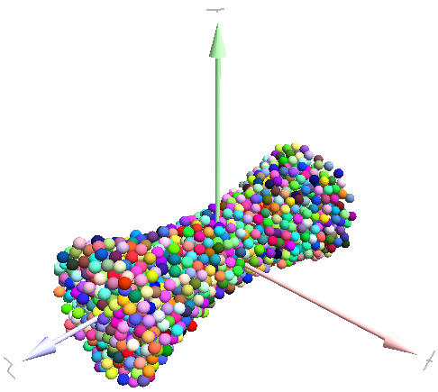
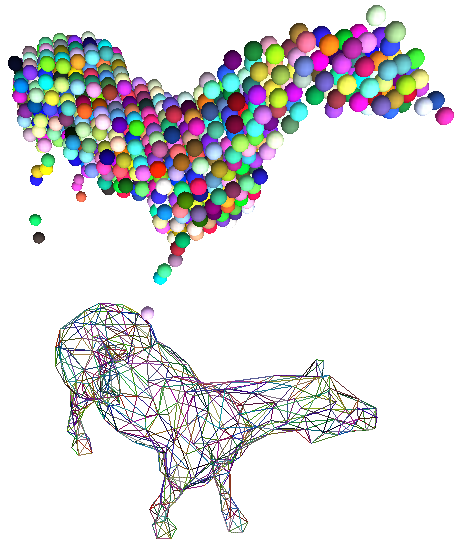
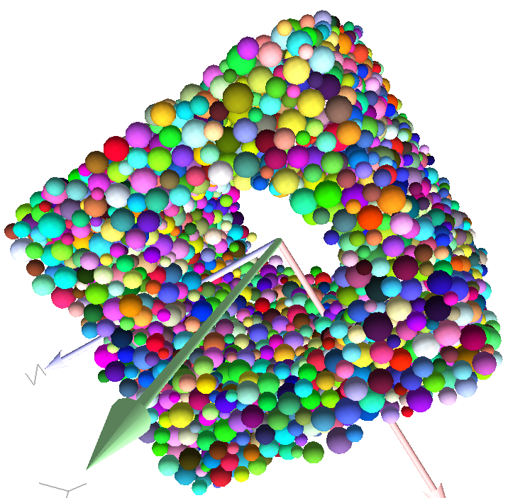
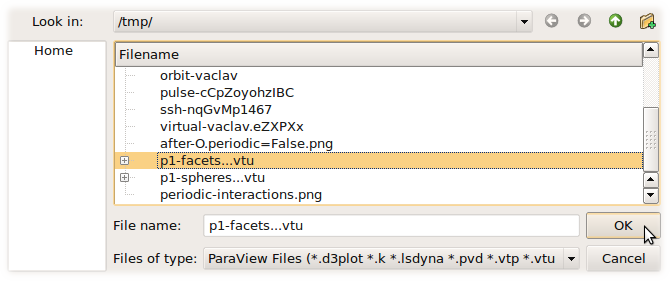
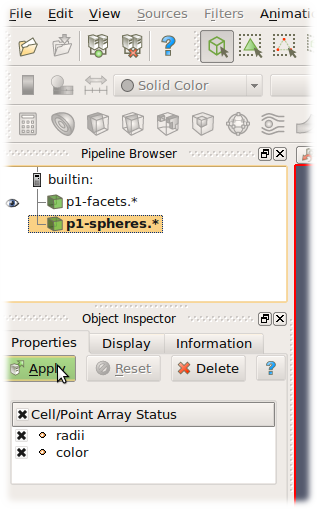

###################
User's manual
###################

*******************
Scene construction
*******************

Adding particles
================

The :yref:`BodyContainer` holds :yref:`Body` objects in the simulation; it is accessible as ``O.bodies``.

Creating Body objects
----------------------

:yref:`Body` objects are only rarely constructed by hand by their components (:yref:`Shape`, :yref:`Bound`, :yref:`State`, :yref:`Material`); instead, convenience functions :yref:`yade.utils.sphere`, :yref:`yade.utils.facet` and :yref:`yade.utils.wall` are used to create them. Using these functions also ensures better future compatibility, if internals of :yref:`Body` change in some way. These functions receive geometry of the particle and several other characteristics. See their documentation for details. If the same :yref:`Material` is used for several (or many) bodies, it can be shared by adding it in ``O.materials``, as explained below.

Defining materials
------------------

The ``O.materials`` object (instance of :yref:`Omega.materials`) holds defined shared materials for bodies. It only supports addition, and will typically hold only a few instance (though there is no limit).

``label`` given to each material is optional, but can be passed to :yref:`yade.utils.sphere` and other functions forconstructing body. The value returned by ``O.materials.append`` is an ``id`` of the material, which can be also passed to :yref:`yade.utils.sphere` -- it is a little bit faster than using label, though not noticeable for small number of particles and perhaps less convenient.

If no :yref:`Material` is specified when calling :yref:`yade.utils.sphere`, the *last* defined material is used; that is a convenient default. If no material is defined yet (hence there is no last material), a default material will be created using :yref:`yade.utils.defaultMaterial`; this should not happen for serious simulations, but is handy in simple scripts, where exact material properties are more or less irrelevant.

.. ipython::

	@suppress
	Yade [0]: O.reset()

	Yade [1]: len(O.materials)

	Yade [2]: idConcrete=O.materials.append(FrictMat(young=30e9,poisson=.2,frictionAngle=.6,label="concrete"))

	Yade [3]: O.materials[idConcrete]

	# uses the last defined material

	Yade [3]: O.bodies.append(utils.sphere(center=(0,0,0),radius=1))

	# material given by id

	Yade [4]: O.bodies.append(utils.sphere((0,0,2),1,material=idConcrete))

	# material given by label

	Yade [5]: O.bodies.append(utils.sphere((0,2,0),1,material="concrete"))

	Yade [3]: idSteel=O.materials.append(FrictMat(young=210e9,poisson=.25,frictionAngle=.8,label="steel"))

	Yade [7]: len(O.materials)

	# implicitly uses "steel" material, as it is the last one now

	Yade [6]: O.bodies.append(utils.facet([(1,0,0),(0,1,0),(-1,-1,0)]))

Adding multiple particles
-------------------------

As shown above, bodies are added one by one or several at the same time using the ``append`` method:

.. ipython::

	@suppress
	Yade [0]: O.reset()

	Yade [1]: O.bodies.append(utils.sphere((0,10,0),1))

	Yade [2]: O.bodies.append(utils.sphere((0,0,2),1))

	# this is the same, but in one function call

	Yade [3]: O.bodies.append([
	   ...:   utils.sphere((0,0,0),1),
	   ...:   utils.sphere((0,0,2),1)
	   ...: ])

Many functions introduced in next sections return list of bodies which can be readily added to the simulation, including

* packing generators, such as :yref:`yade.pack.randomDensePack`, :yref:`yade.pack.regularHexa`
* surface function :yref:`yade.pack.gtsSurface2Facets`
* import functions :yref:`yade.ymport.gmsh`, :yref:`yade.ymport.stl`, …

As those functions use :yref:`yade.utils.sphere` and :yref:`yade.utils.facet` internally, they accept additional argument passed to those function. In particular, material for each body is selected following the rules above (last one if not specified, by label, by index, etc.).

Clumping particles together
----------------------------

In some cases, you might want to create rigid aggregate of individual particles (i.e. particles will retain their mutual position during simulation). This we call a :yref:`clump<Clump>`. 
A clump is internally represented by a special :yref:`body<Body>`, referenced by :yref:`clumpId<Body.clumpId>` of its members (see also  :yref:`isClump<Body.isClump>`, :yref:`isClumpMember<Body.isClumpMember>` and :yref:`isStandalone<Body.isStandalone>`). 
Like every body a clump has a :yref:`position<State.pos>`, which is the balance point between all members. 
A clump body itself has no :yref:`interactions<Interaction>` with other bodies. Interactions between clumps is internally represented by interactions between clump members. There are also no interactions between clump members with same clumpId. 

YADE supports different ways of creating clumps:

* Create clumps and spheres (clump members) directly with one command:

The function :yref:`appendClumped()<BodyContainer.appendClumped>` is designed for this task. For instance, we might add 2 spheres tied together:

.. ipython::

	@suppress
	Yade [0]: O.reset()

	Yade [1]: O.bodies.appendClumped([
	   ...:    utils.sphere([0,0,0],1),
	   ...:    utils.sphere([0,0,2],1)
	   ...: ])

	Yade [2]: len(O.bodies)

	Yade [3]: O.bodies[1].isClumpMember, O.bodies[2].clumpId

	Yade [2]: O.bodies[2].isClump, O.bodies[2].clumpId
	
-> :yref:`appendClumped()<BodyContainer.appendClumped>` returns a tuple of ids ``(clumpId,[memberId1,memberId2,...])``

* Use existing spheres and clump them together:

For this case the function :yref:`clump()<BodyContainer.clump>` can be used. One way to do this is to create a list of bodies, that should be clumped before using the :yref:`clump()<BodyContainer.clump>` command:

.. ipython::

	@suppress
	Yade [0]: O.reset()

	Yade [1]: bodyList = []

	Yade [2]: for ii in range(0,5):
	   ...:    bodyList.append(O.bodies.append(utils.sphere([ii,0,1],.5)))#create a "chain" of 5 spheres
	   ...:

	Yade [3]: print bodyList

	Yade [4]: idClump=O.bodies.clump(bodyList)
	
-> :yref:`clump()<BodyContainer.clump>` returns ``clumpId``

* Another option is to replace :yref:`standalone<Body.isStandalone>` spheres from a given packing (see :yref:`SpherePack<yade._packSpheres.SpherePack>` and :yref:`makeCloud<yade._packSpheres.SpherePack.makeCloud>`) using clump templates.

This is done by a function called :yref:`replaceByClumps()<BodyContainer.replaceByClumps>`. This function takes a list of :yref:`clumpTemplates()<yade.utils.clumpTemplate>` and a list of amounts and replaces spheres by clumps. The volume of a new clump will be the same as the volume of the sphere, that was replaced (clump volume/mass/inertia is accounting for overlaps assuming that there are only pair overlaps).

-> :yref:`replaceByClumps()<yade.wrapper.BodyContainer.replaceByClumps>` returns a list of tuples: ``[(clumpId1,[memberId1,memberId2,...]),(clumpId2,[memberId1,memberId2,...]),...]``

It is also possible to :yref:`add<BodyContainer.addToClump>` bodies to a clump and :yref:`release<BodyContainer.releaseFromClump>` bodies from a clump. Also you can :yref:`erase<BodyContainer.erase>` the clump (clump members will get standalone spheres).

.. note:: Have a look at ``examples/clumps/`` folder. There you will find some examples, that show usage of different functions for clumps.

Sphere packings
===============

Representing a solid of an arbitrary shape by arrangement of spheres presents the problem of sphere packing, i.e. spatial arrangement of sphere such that given solid is approximately filled with them. For the purposes of DEM simulation, there can be several requirements.

#. Distribution of spheres' radii. Arbitrary volume can be filled completely with spheres provided there are no restrictions on their radius; in such case, number of spheres can be infinite and their radii approach zero. Since both number of particles and minimum sphere radius (via critical timestep) determine computation cost, radius distribution has to be given mandatorily. The most typical distribution is uniform: mean±dispersion; if dispersion is zero, all spheres will have the same radius.
#. Smooth boundary. Some algorithms treat boundaries in such way that spheres are aligned on them, making them smoother as surface.
#. Packing density, or the ratio of spheres volume and solid size. It is closely related to radius distribution.
#. Coordination number, (average) number of contacts per sphere.
#. Isotropy (related to regularity/irregularity); packings with preferred directions are usually not desirable, unless the modeled solid also has such preference.
#. Permissible Spheres' overlap; some algorithms might create packing where spheres slightly overlap; since overlap usually causes forces in DEM, overlap-free packings are sometimes called “stress-free‟.

Volume representation
----------------------

There are 2 methods for representing exact volume of the solid in question in Yade: boundary representation and constructive solid geometry. Despite their fundamental differences, they are abstracted in Yade in the :yref:`Predicate<yade.utils._packPredicates.Predicate>` class. Predicate provides the following functionality:

#. defines axis-aligned bounding box for the associated solid (optionally defines oriented bounding box);
#. can decide whether given point is inside or outside the solid; most predicates can also (exactly or approximately) tell whether the point is inside *and* satisfies some given padding distance from the represented solid boundary (so that sphere of that volume doesn't stick out of the solid).

Constructive Solid Geometry (CSG)
^^^^^^^^^^^^^^^^^^^^^^^^^^^^^^^^^^

CSG approach describes volume by geometric *primitives* or primitive solids (sphere, cylinder, box, cone, …) and boolean operations on them. Primitives defined in Yade include :yref:`inCylinder<yade._packPredicates.inCylinder>`, :yref:`inSphere<yade._packPredicates.inSphere>`, :yref:`inEllipsoid<yade._packPredicates.inEllipsoid>`, :yref:`inHyperboloid<yade._packPredicates.inHyperboloid>`, :yref:`notInNotch<yade._packPredicates.notInNotch>`.

For instance, :yref:`hyperboloid<yade._packPredicates.inHyperboloid>` (dogbone) specimen for tension-compression test can be constructed in this way (shown at img. img-hyperboloid_)::

	from yade import pack

	## construct the predicate first
	pred=pack.inHyperboloid(centerBottom=(0,0,-.1),centerTop=(0,0,.1),radius=.05,skirt=.03)
	## alternatively: pack.inHyperboloid((0,0,-.1),(0,0,.1),.05,.03)

	## pack the predicate with spheres (will be explained later)
	spheres=pack.randomDensePack(pred,spheresInCell=2000,radius=3.5e-3)

	## add spheres to simulation
	O.bodies.append(spheres)

.. _img-hyperboloid:

	Specimen constructed with the :yref:`yade._packPredicates.inHyperboloid` predicate, packed with :yref:`yade.pack.randomDensePack`.

Boundary representation (BREP)
^^^^^^^^^^^^^^^^^^^^^^^^^^^^^^

Representing a solid by its boundary is much more flexible than CSG volumes, but is mostly only approximate. Yade interfaces to `GNU Triangulated Surface Library <http://gts.sourceforge.net>`_ (GTS) to import surfaces readable by GTS, but also to construct them explicitly from within simulation scripts. This makes possible parametric construction of rather complicated shapes; there are functions to create set of 3d polylines from 2d polyline (:yref:`yade.pack.revolutionSurfaceMeridians`), to triangulate surface between such set of 3d polylines (:yref:`yade.pack.sweptPolylines2gtsSurface`).

For example, we can construct a simple funnel (:ysrc:`examples/funnel.py`, shown at img-funnel_)::

	from numpy import linspace
	from yade import pack

	# angles for points on circles
	thetas=linspace(0,2*pi,num=16,endpoint=True)

	# creates list of polylines in 3d from list of 2d projections
	# turned from 0 to π
	meridians=pack.revolutionSurfaceMeridians(
		[[(3+rad*sin(th),10*rad+rad*cos(th)) for th in thetas] for rad in linspace(1,2,num=10)],
		linspace(0,pi,num=10)
	)

	# create surface
	surf=pack.sweptPolylines2gtsSurface(
		meridians+
		+[[Vector3(5*sin(-th),-10+5*cos(-th),30) for th in thetas]]  # add funnel top
	)

	# add to simulation
	O.bodies.append(pack.gtsSurface2Facets(surf))

.. _img-funnel:
.. figure:: fig/funnel.*
	:height: 6cm

	Triangulated funnel, constructed with the :ysrc:`examples/funnel.py` script.

GTS surface objects can be used for 2 things:

#. :yref:`yade.pack.gtsSurface2Facets` function can create the triangulated surface (from :yref:`Facet` particles) in the simulation itself, as shown in the funnel example. (Triangulated surface can also be imported directly from a STL file using :yref:`yade.ymport.stl`.)
#. :yref:`yade._packPredicates.inGtsSurface` predicate can be created, using the surface as boundary representation of the enclosed volume.

The :ysrc:`scripts/test/gts-horse.py` (img. img-horse_) shows both possibilities; first, a GTS surface is imported::

	import gts
	surf=gts.read(open('horse.coarse.gts'))

That surface object is used as predicate for packing::

	pred=pack.inGtsSurface(surf)
	O.bodies.append(pack.regularHexa(pred,radius=radius,gap=radius/4.))

and then, after being translated, as base for triangulated surface in the simulation itself::

	surf.translate(0,0,-(aabb[1][2]-aabb[0][2]))
	O.bodies.append(pack.gtsSurface2Facets(surf,wire=True))

.. _img-horse:

	Imported GTS surface (horse) used as packing predicate (top) and surface constructed from :yref:`facets<yade.utils.facet>` (bottom). See http://www.youtube.com/watch?v=PZVruIlUX1A for movie of this simulation.

Boolean operations on predicates
^^^^^^^^^^^^^^^^^^^^^^^^^^^^^^^^

Boolean operations on pair of predicates (noted ``A`` and ``B``) are defined:

* :yref:`intersection<yade._packPredicates.PredicateIntersection>` ``A & B`` (conjunction): point must be in both predicates involved.
* :yref:`union<yade._packPredicates.PredicateUnion>` ``A | B`` (disjunction): point must be in the first or in the second predicate.
* :yref:`difference<yade._packPredicates.PredicateDifference>` ``A - B`` (conjunction with second predicate negated): the point must be in the first predicate and not in the second one.
* :yref:`symmetric difference<yade._packPredicates.PredicateSymmetricDifference>` ``A ^ B`` (exclusive disjunction): point must be in exactly one of the two predicates.

Composed predicates also properly define their bounding box. For example, we can take box and remove cylinder from inside, using the ``A - B`` operation (img. img-predicate-difference_)::

	pred=pack.inAlignedBox((-2,-2,-2),(2,2,2))-pack.inCylinder((0,-2,0),(0,2,0),1)
	spheres=pack.randomDensePack(pred,spheresInCell=2000,radius=.1,rRelFuzz=.4)

.. _img-predicate-difference:

	Box with cylinder removed from inside, using difference of these two predicates.

Packing algorithms
-------------------

Algorithms presented below operate on geometric spheres, defined by their center and radius. With a few exception documented below, the procedure is as follows:

#. Sphere positions and radii are computed (some functions use volume predicate for this, some do not)
#. :yref:`yade.utils.sphere` is called for each position and radius computed; it receives extra `keyword arguments <http://docs.python.org/glossary.html#term-keyword-argument>`_ of the packing function (i.e. arguments that the packing function doesn't specify in its definition; they are noted ``**kw``). Each :yref:`yade.utils.sphere` call creates actual :yref:`Body` objects with :yref:`Sphere` :yref:`shape<Shape>`. List of :yref:`Body` objects is returned.
#. List returned from the packing function can be added to simulation using ``O.bodies.append``.

Taking the example of pierced box::

	pred=pack.inAlignedBox((-2,-2,-2),(2,2,2))-pack.inCylinder((0,-2,0),(0,2,0),1)
	spheres=pack.randomDensePack(pred,spheresInCell=2000,radius=.1,rRelFuzz=.4,wire=True,color=(0,0,1),material=1)

Keyword arguments ``wire``, ``color`` and ``material`` are not declared in :yref:`yade.pack.randomDensePack`, therefore will be passed to :yref:`yade.utils.sphere`, where they are also documented. ``spheres`` is now list of :yref:`Body` objects, which we add to the simulation::

	O.bodies.append(spheres)

Packing algorithms described below produce dense packings. If one needs loose packing, :yref:`yade._packSpheres.SpherePack` class provides functions for generating loose packing, via its :yref:`yade._packSpheres.SpherePack.makeCloud` method. It is used internally for generating initial configuration in dynamic algorithms. For instance::

	from yade import pack
	sp=pack.SpherePack()
	sp.makeCloud(minCorner=(0,0,0),maxCorner=(3,3,3),rMean=.2,rRelFuzz=.5)

will fill given box with spheres, until no more spheres can be placed. The object can be used to add spheres to simulation::

	for c,r in sp: O.bodies.append(utils.sphere(c,r))

or, in a more pythonic way, with one single ``O.bodies.append`` call::

	O.bodies.append([utils.sphere(c,r) for c,r in sp])

Geometric
^^^^^^^^^

Geometric algorithms compute packing without performing dynamic simulation; among their advantages are

* speed;
* spheres touch exactly, there are no overlaps (what some people call "stress-free" packing);

their chief disadvantage is that radius distribution cannot be prescribed exactly, save in specific cases (regular packings); sphere radii are given by the algorithm, which already makes the system determined. If exact radius distribution is important for your problem, consider dynamic algorithms instead.

Regular
"""""""""
Yade defines packing generators for spheres with constant radii, which can be used with volume predicates as described above. They are dense orthogonal packing (:yref:`yade.pack.regularOrtho`) and dense hexagonal packing (:yref:`yade.pack.regularHexa`). The latter creates so-called "hexagonal close packing", which achieves maximum density (http://en.wikipedia.org/wiki/Close-packing_of_spheres).

Clear disadvantage of regular packings is that they have very strong directional preferences, which might not be an issue in some cases.

Irregular
""""""""""
Random geometric algorithms do not integrate at all with volume predicates described above; rather, they take their own boundary/volume definition, which is used during sphere positioning. On the other hand, this makes it possible for them to respect boundary in the sense of making spheres touch it at appropriate places, rather than leaving empty space in-between.

:yref:`yade._packSpherePadder.SpherePadder`
	constructs dense sphere packing based on pre-computed tetrahedron mesh; it is documented in :yref:`yade._packSpherePadder.SpherePadder` documentation; sample script is in :ysrc:`scripts/test/SpherePadder.py`. :yref:`yade._packSpherePadder.SpherePadder` does not return :yref:`Body` list as other algorithms, but a :yref:`yade._packSpheres.SpherePack` object; it can be iterated over, adding spheres to the simulation, as shown in its documentation.
GenGeo
	is library (python module) for packing generation developed with `ESyS-Particle <http://www.launchpad.net/esys-particle>`_. It creates packing by random insertion of spheres with given radius range. Inserted spheres touch each other exactly and, more importantly, they also touch the boundary, if in its neighbourhood. Boundary is represented as special object of the GenGeo library (Sphere, cylinder, box, convex polyhedron, …). Therefore, GenGeo cannot be used with volume represented by yade predicates as explained above.

	Packings generated by this module can be imported directly via :yref:`yade.ymport.gengeo`, or from saved file via :yref:`yade.ymport.gengeoFile`. There is an example script :ysrc:`scripts/test/genCylLSM.py`. Full documentation for GenGeo can be found at `ESyS documentation website <http://esys.esscc.uq.edu.au/docs.html>`_.

	To our knowledge, the GenGeo library is not currently packaged. It can be downloaded from current subversion repository ::

		svn checkout https://svn.esscc.uq.edu.au/svn/esys3/lsm/contrib/LSMGenGeo

	then following instruction in the ``INSTALL`` file.

Dynamic
^^^^^^^

The most versatile algorithm for random dense packing is provided by :yref:`yade.pack.randomDensePack`. Initial loose packing of non-overlapping spheres is generated by randomly placing them in cuboid volume, with radii given by requested (currently only uniform) radius distribution. When no more spheres can be inserted, the packing is compressed and then uncompressed (see :ysrc:`py/pack/pack.py` for exact values of these "stresses") by running a DEM simulation; :yref:`Omega.switchScene` is used to not affect existing simulation). Finally, resulting packing is clipped using provided predicate, as explained above.

By its nature, this method might take relatively long; and there are 2 provisions to make the computation time shorter:

* If number of spheres using the ``spheresInCell`` parameter is specified, only smaller specimen with *periodic* boundary is created and then repeated as to fill the predicate. This can provide high-quality packing with low regularity, depending on the ``spheresInCell`` parameter (value of several thousands is recommended).
* Providing ``memoizeDb`` parameter will make :yref:`yade.pack.randomDensePack` first look into provided file (SQLite database) for packings with similar parameters. On success, the packing is simply read from database and returned. If there is no similar pre-existent packing, normal procedure is run, and the result is saved in the database before being returned, so that subsequent calls with same parameters will return quickly.

If you need to obtain full periodic packing (rather than packing clipped by predicate), you can use :yref:`yade.pack.randomPeriPack`.

In case of specific needs, you can create packing yourself, "by hand". For instance, packing boundary can be constructed from :yref:`facets<Facet>`, letting randomly positioned spheres in space fall down under gravity.

Triangulated surfaces
=====================

Yade integrates with the the `GNU Triangulated Surface library <http://gts.sourceforge.net>`_, exposed in python via the 3rd party :yref:`external:gts` module. GTS provides variety of functions for surface manipulation (coarsening, tesselation, simplification, import), to be found in its documentation.

GTS surfaces are geometrical objects, which can be inserted into simulation as set of particles whose :yref:`Body.shape` is of type :yref:`Facet` -- single triangulation elements. :yref:`pack.gtsSurface2Facets` can be used to convert GTS surface triangulation into list of :yref:`bodies<Body>` ready to be inserted into simulation via ``O.bodies.append``.

Facet particles are created by default as non-:yref:`Body.dynamic` (they have zero inertial mass). That means that  they are fixed in space and will not move if subject to forces. You can however

* prescribe arbitrary movement to facets using a :yref:`PartialEngine` (such as :yref:`TranslationEngine` or :yref:`RotationEngine`);
* assign explicitly :yref:`mass<State.mass>` and :yref:`inertia<State.inertia>` to that particle;
* make that particle part of a clump and assign :yref:`mass<State.mass>` and :yref:`inertia<State.inertia>` of the clump itself (described below).

.. note::
	Facets can only (currently) interact with :yref:`spheres<Sphere>`, not with other facets, even if they are *dynamic*. Collision of 2 :yref:`facets<Facet>` will not create interaction, therefore no forces on facets.

Import
-------

Yade currently offers 3 formats for importing triangulated surfaces from external files, in the :yref:`yade.ymport` module:

:yref:`yade.ymport.gts`
	text file in native GTS format.
:yref:`yade.ymport.stl`
	STereoLitography format, in either text or binary form; exported from `Blender <http://www.blender.org>`_, but from many CAD systems as well.
:yref:`yade.ymport.gmsh`.
	text file in native format for `GMSH <http://www.geuz.org/gmsh/>`_, popular open-source meshing program.

If you need to manipulate surfaces before creating list of facets, you can study the :ysrc:`py/ymport.py` file where the import functions are defined. They are rather simple in most cases.

Parametric construction
------------------------

The :yref:`external:gts` module provides convenient way of creating surface by vertices, edges and triangles.

Frequently, though, the surface can be conveniently described as surface between polylines in space. For instance, cylinder is surface between two polygons (closed polylines). The :yref:`yade.pack.sweptPolylines2gtsSurface` offers the functionality of connecting several polylines with triangulation.

.. note::
	The implementation of :yref:`yade.pack.sweptPolylines2gtsSurface` is rather simplistic: all polylines must be of the same length, and they are connected with triangles between points following their indices within each polyline (not by distance). On the other hand, points can be co-incident, if the ``threshold`` parameter is positive: degenerate triangles with vertices closer that ``threshold`` are automatically eliminated.

Manipulating lists efficiently (in terms of code length) requires being familiar with `list comprehensions <http://docs.python.org/tutorial/datastructures.html#list-comprehensions>`_ in python.

..
	FIXME
	some example here

Another examples can be found in :ysrc:`examples/mill.py` (fully parametrized) or :ysrc:`examples/funnel.py` (with hardcoded numbers).

.. _creating-interactions:

Creating interactions
======================

In typical cases, interactions are created during simulations as particles collide. This is done by a :yref:`Collider` detecting approximate contact between particles and then an :yref:`IGeomFunctor` detecting exact collision.

Some material models (such as the :yref:`concrete model<Law2_Dem3DofGeom_CpmPhys_Cpm>`) rely on initial interaction network which is denser than geometrical contact of spheres: sphere's radii as "enlarged" by a dimensionless factor called *interaction radius* (or *interaction ratio*) to create this initial network. This is done typically in this way (see :ysrc:`examples/concrete/uniax.py` for an example):

#. Approximate collision detection is adjusted so that approximate contacts are detected also between particles within the interaction radius. This consists in setting value of :yref:`Bo1_Sphere_Aabb.aabbEnlargeFactor` to the interaction radius value.

#. The geometry functor (``Ig2``)
   would normally say that "there is no contact" if given 2 spheres that are not in contact. Therefore, the same value as for :yref:`Bo1_Sphere_Aabb.aabbEnlargeFactor` must be given to it. (Either :yref:`Ig2_Sphere_Sphere_Dem3DofGeom.distFactor` or :yref:`Ig2_Sphere_Sphere_ScGeom.interactionDetectionFactor`, depending on the functor that is in use.

   Note that only :yref:`Sphere` + :yref:`Sphere` interactions are supported; there is no parameter analogous to :yref:`distFactor<Ig2_Sphere_Sphere_Dem3DofGeom.distFactor>` in :yref:`Ig2_Facet_Sphere_Dem3DofGeom`. This is on purpose, since the interaction radius is meaningful in bulk material represented by sphere packing, whereas facets usually represent boundary conditions which should be exempt from this dense interaction network.

#. Run one single step of the simulation so that the initial network is created.

#. Reset interaction radius in both ``Bo1`` and ``Ig2`` functors to their default value again.

#. Continue the simulation; interactions that are already established will not be deleted (the ``Law2`` functor in usepermitting).

In code, such scenario might look similar to this one (labeling is explained in :ref:`labelingthings`)::

	intRadius=1.5

	O.engines=[
	   ForceResetter(),
	   InsertionSortCollider([
	      # enlarge here
	      Bo1_Sphere_Aabb(aabbEnlargeFactor=intRadius,label='bo1s'),
	      Bo1_Facet_Aabb(),
		]),
	   InteractionLoop(
	      [
	         # enlarge here
	         Ig2_Sphere_Sphere_Dem3DofGeom(distFactor=intRadius,label='ig2ss'),
	         Ig2_Facet_Sphere_Dem3DofGeom(),
	      ],
	      [Ip2_CpmMat_CpmMat_CpmPhys()],
	      [Law2_Dem3DofGeom_CpmPhys_Cpm(epsSoft=0)], # deactivated
	   ),
	   NewtonIntegrator(damping=damping,label='damper'),
	]

	# run one single step
	O.step()

	# reset interaction radius to the default value
	# see documentation of those attributes for the meaning of negative values
	bo1s.aabbEnlargeFactor=-1
	ig2ss.distFactor=-1

	# now continue simulation
	O.run()

Individual interactions on demand
----------------------------------

It is possible to create an interaction between a pair of particles independently of collision detection using :yref:`yade.utils.createInteraction`. This function looks for and uses matching ``Ig2`` and ``Ip2`` functors. Interaction will be created regardless of distance between given particles (by passing a special parameter to the ``Ig2`` functor to force creation of the interaction even without any geometrical contact). Appropriate constitutive law should be used to avoid deletion of the interaction at the next simulation step.

.. ipython::

	@suppress
	Yade [1]: O.reset()

	Yade [1]: O.materials.append(FrictMat(young=3e10,poisson=.2,density=1000))

	Yade [1]: O.bodies.append([
	   ...:    utils.sphere([0,0,0],1),
	   ...:    utils.sphere([0,0,1000],1)
	   ...: ])

	# only add InteractionLoop, no other engines are needed now
	Yade [1]: O.engines=[
	   ...:    InteractionLoop(
	   ...:        [Ig2_Sphere_Sphere_Dem3DofGeom(),],
	   ...:        [Ip2_FrictMat_FrictMat_FrictPhys()],
	   ...:        [] # not needed now
	   ...:    )
	   ...: ]

	Yade [1]: i=utils.createInteraction(0,1)

	# created by functors in InteractionLoop
	Yade [2]: i.geom, i.phys

This method will be rather slow if many interaction are to be created (the functor lookup will be repeated for each of them). In such case, ask on yade-dev@lists.launchpad.net to have the :yref:`yade.utils.createInteraction` function accept list of pairs id's as well.

Base engines
=============

A typical DEM simulation in Yade does at least the following at each step (see :ref:`function-components` for details):

#. Reset forces from previous step
#. Detect new collisions
#. Handle interactions
#. Apply forces and update positions of particles

Each of these points corresponds to one or several engines::

	O.engines=[
	   ForceResetter(),          # reset forces
	   InsertionSortCollider([...]),  # approximate collision detection
	   InteractionLoop([...],[...],[...]) # handle interactions
	   NewtonIntegrator()        # apply forces and update positions
	]

The order of engines is important. In majority of cases, you will put any additional engine after :yref:`InteractionLoop`:

* if it apply force, it should come before :yref:`NewtonIntegrator`, otherwise the force will never be effective.
* if it makes use of bodies' positions, it should also come before :yref:`NewtonIntegrator`, otherwise, positions at the next step will be used (this might not be critical in many cases, such as output for visualization with :yref:`VTKRecorder`).

The :yref:`O.engines<Omega.engines>` sequence must be always assigned at once (the reason is in the fact that although engines themselves are passed by reference, the sequence is *copied* from c++ to Python or from Python to c++). This includes modifying an existing ``O.engines``; therefore ::

	O.engines.append(SomeEngine()) # wrong

will not work; ::
  
	O.engines=O.engines+[SomeEngine()] # ok

must be used instead. For inserting an engine after position #2 (for example), use python slice notation::

	O.engines=O.engines[:2]+[SomeEngine()]+O.engines[2:]

.. note::
	When Yade starts, O.engines is filled with a reasonable default list, so that it is not strictly necessary to redefine it when trying simple things. The default scene will handle spheres, boxes, and facets with :yref:`frictional<FrictMat>` properties correctly, and adjusts the timestep dynamically. You can find an example in simple-scene-default-engines.py.

Functors choice
----------------

In the above example, we omited functors, only writing ellipses ``...`` instead. As explained in :ref:`dispatchers-and-functors`, there are 4 kinds of functors and associated dispatchers. User can choose which ones to use, though the choice must be consistent.

Bo1 functors
^^^^^^^^^^^^
``Bo1`` functors must be chosen depending on the collider in use; they are given directly to the collider (which internally uses :yref:`BoundDispatcher`).

At this moment (September 2010), the most common choice is :yref:`InsertionSortCollider`, which uses :yref:`Aabb`; functors creating :yref:`Aabb` must be used in that case. Depending on particle :yref:`shapes<Shape>` in your simulation, choose appropriate functors::

   O.engines=[...,
      InsertionSortCollider([Bo1_Sphere_Aabb(),Bo1_Facet_Aabb()]),
      ...
   ]

Using more functors than necessary (such as :yref:`Bo1_Facet_Aabb` if there are no :yref:`facets<Facet>` in the simulation) has no performance penalty. On the other hand, missing functors for existing :yref:`shapes<Shape>` will cause those bodies to not collider with other bodies (they will freely interpenetrate).

There are other colliders as well, though their usage is only experimental:

* :yref:`SpatialQuickSortCollider` is correctness-reference collider operating on :yref:`Aabb`; it is significantly slower than :yref:`InsertionSortCollider`.
* :yref:`PersistentTriangulationCollider` only works on spheres; it does not use a :yref:`BoundDispatcher`, as it operates on spheres directly.
* :yref:`FlatGridCollider` is proof-of-concept grid-based collider, which computes grid positions internally (no :yref:`BoundDispatcher` either)

Ig2 functors
^^^^^^^^^^^^^

``Ig2`` functor choice (all of the derive from :yref:`IGeomFunctor`) depends on 

#. shape combinations that should collide;
   for instance::

      InteractionLoop([Ig2_Sphere_Sphere_Dem3DofGeom()],[],[])

   will handle collisions for :yref:`Sphere` + :yref:`Sphere`, but not for :yref:`Facet` + :yref:`Sphere` -- if that is desired, an additional functor must be used::
   
      InteractionLoop([
         Ig2_Sphere_Sphere_Dem3DofGeom(),
         Ig2_Facet_Sphere_Dem3DofGeom()
      ],[],[])
   
   Again, missing combination will cause given shape combinations to freely interpenetrate one another.

#. :yref:`IGeom` type accepted by the ``Law2`` functor (below); it is the first part of functor's name after ``Law2`` (for instance, :yref:`Law2_Dem3DofGeom_CpmPhys_Cpm` accepts :yref:`Dem3DofGeom`). This is (for most cases) either :yref:`Dem3DofGeom` (total shear formulation) or :yref:`ScGeom` (incremental shear formulation). For :yref:`ScGeom`, the above example would simply change to::

      InteractionLoop([
         Ig2_Sphere_Sphere_ScGeom(),
         Ig2_Facet_Sphere_ScGeom()
      ],[],[])

Ip2 functors
^^^^^^^^^^^^

``Ip2`` functors (deriving from :yref:`IPhysFunctor`) must be chosen depending on

#. :yref:`Material` combinations within the simulation. In most cases, ``Ip2`` functors handle 2 instances of the same :yref:`Material` class (such as :yref:`Ip2_FrictMat_FrictMat_FrictPhys` for 2 bodies with :yref:`FrictMat`) 

#. :yref:`IPhys` accepted by the constitutive law (``Law2`` functor), which is the second part of the ``Law2`` functor's name (e.g. :yref:`Law2_ScGeom_FrictPhys_CundallStrack` accepts :yref:`FrictPhys`)

.. note:: Unlike with ``Bo1`` and ``Ig2`` functors, unhandled combination of :yref:`Materials<Material>` is an error condition signaled by an exception.

Law2 functor(s)
^^^^^^^^^^^^^^^^

``Law2`` functor was the ultimate criterion for the choice of ``Ig2`` and ``Ip2`` functors; there are no restrictions on its choice in itself, as it only applies forces without creating new objects.

In most simulations, only one ``Law2`` functor will be in use; it is possible, though, to have several of them, dispatched based on combination of :yref:`IGeom` and :yref:`IPhys` produced previously by ``Ig2`` and ``Ip2`` functors respectively (in turn based on combination of :yref:`Shapes<Shape>` and :yref:`Materials<Material>`).

.. note:: As in the case of ``Ip2`` functors, receiving a combination of :yref:`IGeom` and :yref:`IPhys` which is not handled by any ``Law2`` functor is an error.

.. warning:: Many ``Law2`` exist in Yade, and new ones can appear at any time. In some cases different functors are only different implementations of the same contact law (e.g. :yref:`Law2_ScGeom_FrictPhys_CundallStrack` and :yref:`Law2_L3Geom_FrictPhys_ElPerfPl`). Also, sometimes, the peculiarity of one functor may be reproduced as a special case of a more general one. Therefore, for a given constitutive behavior, the user may have the choice between different functors. It is strongly recommended to favor the most used and most validated implementation when facing such choice. A list of available functors classified from mature to unmaintained is updated `here <https://yade-dem.org/wiki/ConstitutiveLaws`_ to guide this choice.

Examples
^^^^^^^^

Let us give several example of the chain of created and accepted types.

Basic DEM model
^^^^^^^^^^^^^^^^
Suppose we want to use the :yref:`Law2_ScGeom_FrictPhys_CundallStrack` constitutive law. We see that

#. the ``Ig2`` functors must create :yref:`ScGeom`. If we have for instance :yref:`spheres<Sphere>` and :yref:`boxes<Box>` in the simulation, we will need functors accepting :yref:`Sphere` + :yref:`Sphere` and :yref:`Box` + :yref:`Sphere` combinations. We don't want interactions between boxes themselves (as a matter of fact, there is no such functor anyway). That gives us :yref:`Ig2_Sphere_Sphere_ScGeom` and :yref:`Ig2_Box_Sphere_ScGeom`.

#. the ``Ip2`` functors should create :yref:`FrictPhys`. Looking at :yref:`InteractionPhysicsFunctors<IPhysFunctor>`, there is only :yref:`Ip2_FrictMat_FrictMat_FrictPhys`. That obliges us to use :yref:`FrictMat` for particles.

The result will be therefore::

   InteractionLoop(
      [Ig2_Sphere_Sphere_ScGeom(),Ig2_Box_Sphere_ScGeom()],
      [Ip2_FrictMat_FrictMat_FrictPhys()],
      [Law2_ScGeom_FrictPhys_CundallStrack()]
   )

Concrete model
^^^^^^^^^^^^^^^
In this case, our goal is to use the :yref:`Law2_Dem3DofGeom_CpmPhys_Cpm` constitutive law.

* We use :yref:`spheres<Sphere>` and :yref:`facets<Facet>` in the simulation, which selects ``Ig2`` functors accepting those types and producing :yref:`Dem3DofGeom`: :yref:`Ig2_Sphere_Sphere_Dem3DofGeom` and :yref:`Ig2_Facet_Sphere_Dem3DofGeom`.

* We have to use :yref:`Material` which can be used for creating :yref:`CpmPhys`. We find that :yref:`CpmPhys` is only  created by :yref:`Ip2_CpmMat_CpmMat_CpmPhys`, which determines the choice of :yref:`CpmMat` for all particles.

Therefore, we will use::

   InteractionLoop(
      [Ig2_Sphere_Sphere_Dem3DofGeom(),Ig2_Facet_Sphere_Dem3DofGeom()],
      [Ip2_CpmMat_CpmMat_CpmPhys()],
      [Law2_Dem3DofGeom_CpmPhys_Cpm()]
   )

Imposing conditions
====================

In most simulations, it is not desired that all particles float freely in space. There are several ways of imposing boundary conditions that block movement of all or some particles with regard to global space.

Motion constraints
------------------

* :yref:`Body.dynamic` determines whether a body will be moved by :yref:`NewtonIntegrator`; it is mandatory for bodies with zero mass, where applying non-zero force would result in infinite displacement.

  :yref:`Facets<Facet>` are case in the point: :yref:`yade.utils.facet` makes them non-dynamic by default, as they have zero volume and zero mass (this can be changed, by passing ``dynamic=True`` to :yref:`yade.utils.facet` or setting :yref:`Body.dynamic`; setting :yref:`State.mass` to a non-zero value must be done as well). The same is true for :yref:`yade.utils.wall`.

  Making sphere non-dynamic is achieved simply by::

     utils.sphere([x,y,z],radius,dynamic=False)

  .. note:: There is an open `bug #398089 <https://bugs.launchpad.net/yade/+bug/398089>`_ to define exactly what the ``dynamic`` flag does. Please read it before writing a new engine relying on this flag.

* :yref:`State.blockedDOFs` permits selective blocking
  of any of 6 degrees of freedom in global space. For instance, a sphere can be made to move only in the xy plane by saying:

  .. ipython::

     @suppress
     Yade [1]: O.reset()

     Yade [1]: O.bodies.append(utils.sphere((0,0,0),1))

     Yade [1]: O.bodies[0].state.blockedDOFs=['z','rx','ry']

  In contrast to :yref:`Body.dynamic`, :yref:`blockedDOFs<State.blockedDOFs>` will only block forces (and acceleration) in that direction being effective; if you prescribed linear or angular velocity, they will be applied regardless of :yref:`blockedDOFs<State.blockedDOFs>`. (This is also related to `bug #398089 <https://bugs.launchpad.net/yade/+bug/398089>`_ mentioned above)

It might be desirable to constrain motion of some particles constructed from a generated sphere packing, following some condition, such as being at the bottom of a specimen; this can be done by looping over all bodies with a conditional::

	for b in O.bodies:
	   # block all particles with z coord below .5:
	   if b.state.pos[2]<.5: b.dynamic=False

Arbitrary spatial predicates introduced above can be expoited here as well::

	from yade import pack
	pred=pack.inAlignedBox(lowerCorner,upperCorner)
	for b in O.bodies:
	   if b.shape.name!=Sphere: continue # skip non-spheres
	   # ask the predicate if we are inside
	   if pred(b.state.pos,b.shape.radius): b.dynamic=False

Boundary controllers
--------------------

Engines deriving from :yref:`BoundaryController` impose boundary conditions during simulation, either directly, or by influencing several bodies. You are referred to their individual documentation for details, though you might find interesting in particular

* :yref:`UniaxialStrainer` for applying strain along one axis at constant rate; useful for plotting strain-stress diagrams for uniaxial loading case. See :ysrc:`examples/concrete/uniax.py` for an example.
* :yref:`TriaxialStressController` which applies prescribed stress/strain along 3 perpendicular axes on cuboid-shaped packing using 6 walls (:yref:`Box` objects) (:yref:`ThreeDTriaxialEngine` is generalized such that it allows independent value of stress along each axis)
* :yref:`PeriTriaxController` for applying stress/strain along 3 axes independently, for simulations using periodic boundary conditions (:yref:`Cell`)

Field appliers
---------------

Engines deriving from :yref:`FieldApplier` acting on all particles. The one most used is :yref:`GravityEngine` applying uniform acceleration field.

Partial engines
---------------

Engines deriving from :yref:`PartialEngine` define the :yref:`ids<PartialEngine.subscribedBodies>` attribute determining bodies which will be affected. Several of them warrant explicit mention here:

* :yref:`TranslationEngine` and :yref:`RotationEngine` for applying constant speed linear and rotational motion on subscribers. 
* :yref:`ForceEngine` and :yref:`TorqueEngine` applying given values of force/torque on subscribed bodies at every step.
* :yref:`StepDisplacer` for applying generalized displacement delta at every timestep; designed for precise control of motion when testing constitutive laws on 2 particles.

If you need an engine applying non-constant value instead, there are several interpolating engines (:yref:`InterpolatingDirectedForceEngine` for applying force with varying magnitude, :yref:`InterpolatingSpiralEngine` for applying spiral displacement with varying angular velocity and possibly others); writing a new interpolating engine is rather simple using examples of those that already exist.

Convenience features
=========================

.. _labelingthings:

Labeling things
----------------
Engines and functors can define that ``label`` attribute. Whenever the ``O.engines`` sequence is modified, python variables of those names are created/update; since it happens in the ``__builtins__`` namespaces, these names are immediately accessible from anywhere. This was used in :ref:`creating-interactions` to change interaction radius in multiple functors at once.

.. warning:: Make sure you do not use label that will overwrite (or shadow) an object that you already use under that variable name. Take care not to use syntactically wrong names, such as "er*452" or "my engine"; only variable names permissible in Python can be used.

Simulation tags
----------------

:yref:`Omega.tags` is a dictionary (it behaves like a dictionary, although the implementation in c++ is different) mapping keys to labels. Contrary to regular python dictionaries that you could create,

* ``O.tags`` is *saved and loaded with simulation*;
* ``O.tags`` has some values pre-initialized.

After Yade startup, ``O.tags`` contains the following:

.. ipython::

	@suppress
	Yade [1]: O.reset()

	Yade [1]: dict(O.tags) # convert to real dictionary

author
	Real name, username and machine as obtained from your system at simulation creation
id
	Unique identifier of this Yade instance (or of the instance which created a loaded simulation). It is composed of date, time and process number. Useful if you run simulations in parallel and want to avoid overwriting each other's outputs; embed ``O.tags['id']`` in output filenames (either as directory name, or as part of the file's name itself) to avoid it. This is explained in :ref:`batch-output-separate` in detail.
isoTime
	Time when simulation was created (with second resolution).
d.id, id.d
	Simulation description and id joined by period (and vice-versa). Description is used in batch jobs; in non-batch jobs, these tags are identical to id.

You can add your own tags by simply assigning value, with the restriction that the left-hand side object must be a string and must not contain ``=``.

.. ipython::
	
	Yade [2]: O.tags['anythingThat I lik3']='whatever'

	Yade [2]: O.tags['anythingThat I lik3']

Saving python variables
------------------------

Python variable lifetime is limited; in particular, if you save simulation, variables will be lost after reloading. Yade provides limited support for data persistence for this reason (internally, it uses special values of ``O.tags``). The functions in question are :yref:`yade.utils.saveVars` and :yref:`yade.utils.loadVars`. 

:yref:`yade.utils.saveVars` takes dictionary (variable names and their values) and a *mark* (identification string for the variable set); it saves the dictionary inside the simulation. These variables can be re-created (after the simulation was loaded from a XML file, for instance) in the ``yade.params.``\ *mark* namespace by calling :yref:`yade.utils.loadVars` with the same identification *mark*:

.. ipython::

	Yade [3]: a=45; b=pi/3

	Yade [3]: utils.saveVars('ab',a=a,b=b)
	# save simulation (we could save to disk just as well)
	Yade [3]: O.saveTmp()

	Yade [4]: O.loadTmp()

	Yade [4]: utils.loadVars('ab')

	Yade [5]: yade.params.ab.a
	
	# import like this
	Yade [5]: from yade.params import ab

	Yade [6]: ab.a, ab.b

	# also possible
	Yade [5]: from yade.params import *

	Yade [6]: ab.a, ab.b

Enumeration of variables can be tedious if they are many; creating local scope (which is a function definition in Python, for instance) can help::

	def setGeomVars():
		radius=a*4
		thickness=22
		p_t=4/3*pi
		dim=Vector3(1.23,2.2,3)
		#
		# define as much as you want here
		# it all appears in locals() (and nothing else does)
		#
		utils.saveVars('geom',loadNow=True,**locals())
	
	setGeomVars()
	from yade.params.geom import *
	# use the variables now

.. note:: Only types that can be `pickled <http://docs.python.org/library/pickle.html>`_ can be passed to :yref:`yade.utils.saveVars`.

*************************
Controlling simulation
*************************

Tracking variables
===================

Running python code
-------------------

A special engine :yref:`PyRunner` can be used to periodically call python code, specified via the ``command`` parameter. Periodicity can be controlled by specifying computation time (``realPeriod``), virutal time (``virtPeriod``) or iteration number (``iterPeriod``).

For instance, to print kinetic energy (using :yref:`yade.utils.kineticEnergy`) every 5 seconds, this engine will be put to ``O.engines``::
	PyRunner(command="print 'kinetic energy',utils.kineticEnergy()",realPeriod=5)

For running more complex commands, it is convenient to define an external function and only call it from within the engine. Since the ``command`` is run in the script's namespace, functions defined within scripts can be called. Let us print information on interaction between bodies 0 and 1 periodically::

	def intrInfo(id1,id2):
		try:
			i=O.interactions[id1,id2]
			# assuming it is a CpmPhys instance
			print id1,id2,i.phys.sigmaN
		except:
			# in case the interaction doesn't exist (yet?)
			print "No interaction between",id1,id2
	O.engines=[...,
		PyRunner(command="intrInfo(0,1)",realPeriod=5)
	]

More useful examples will be given below.

The :yref:`yade.plot` module provides simple interface and storage for tracking various data. Although originally conceived for plotting only, it is widely used for tracking variables in general.

The data are in :yref:`yade.plot.data` dictionary, which maps variable names to list of their values; the :yref:`yade.plot.addData` function is used to add them.

.. ipython::

	@suppress
	Yade [1]: O.reset()

	Yade [1]: from yade import plot

	Yade [1]: plot.data

	Yade [1]: plot.addData(sigma=12,eps=1e-4)

	# not adding sigma will add a NaN automatically
	# this assures all variables have the same number of records
	Yade [2]: plot.addData(eps=1e-3)

	# adds NaNs to already existing sigma and eps columns
	Yade [3]: plot.addData(force=1e3)

	Yade [4]: plot.data

	# retrieve only one column
	Yade [5]: plot.data['eps']

	# get maximum eps
	Yade [5]: max(plot.data['eps'])

New record is added to all columns at every time :yref:`yade.plot.addData` is called; this assures that lines in different columns always match. The special value ``nan`` or ``NaN`` (`Not a Number <http://en.wikipedia.org/wiki/NaN>`_) is inserted to mark the record invalid.

.. note:: It is not possible to have two columns with the same name, since data are stored as a dictionary.

To record data periodically, use :yref:`PyRunner`. This will record the *z* coordinate and velocity of body #1, iteration number and simulation time (every 20 iterations)::

	O.engines=O.engines+[PyRunner(command='myAddData()', iterPeriod=20)]

	from yade import plot
	def myAddData():
		b=O.bodies[1]
		plot.addData(z1=b.state.pos[2], v1=b.state.vel.norm(), i=O.iter, t=O.time)

.. note::

	Arbitrary string can be used as column label for :yref:`yade.plot.data`. If it cannot be used as keyword name for :yref:`yade.plot.addData` (since it is a python keyword (``for``), or has spaces inside (``my funny column``), you can pass dictionary to :yref:`yade.plot.addData` instead::

		plot.addData(z=b.state.pos[2],**{'my funny column':b.state.vel.norm()})

	An exception are columns having leading of trailing whitespaces. They are handled specially in :yref:`yade.plot.plots` and should not be used (see below).

Labels can be conveniently used to access engines in the ``myAddData`` function::

	O.engines=[...,
		UniaxialStrainer(...,label='strainer')
	]
	def myAddData():
		plot.addData(sigma=strainer.stress,eps=strainer.strain)

In that case, naturally, the labeled object must define attributes which are used (:yref:`UniaxialStrainer.strain` and :yref:`UniaxialStrainer.stress` in this case).

Plotting variables
-------------------
Above, we explained how to track variables by storing them using :yref:`yade.plot.addData`. These data can be readily used for plotting. Yade provides a simple, quick to use, plotting in the :yref:`yade.plot` module. Naturally, since direct access to underlying data is possible via :yref:`yade.plot.data`, these data can be processed in any way.

The :yref:`yade.plot.plots` dictionary is a simple specification of plots. Keys are x-axis variable, and values are tuple of y-axis variables, given as strings that were used for :yref:`yade.plot.addData`; each entry in the dictionary represents a separate figure::

	plot.plots={
		'i':('t',),     # plot t(i)
		't':('z1','v1') # z1(t) and v1(t)
	}

Actual plot using data in :yref:`yade.plot.data` and plot specification of :yref:`yade.plot.plots` can be triggered by invoking the :yref:`yade.plot.plot` function.

Live updates of plots
^^^^^^^^^^^^^^^^^^^^^

Yade features live-updates of figures during calculations. It is controlled by following settings:

* :yref:`yade.plot.live` - By setting ``yade.plot.live=True`` you can watch the plot being updated while the calculations run. Set to ``False`` otherwise.
* :yref:`yade.plot.liveInterval` - This is the interval in seconds between the plot updates.
* :yref:`yade.plot.autozoom` - When set to ``True`` the plot will be automatically rezoomed.

Controlling line properties
^^^^^^^^^^^^^^^^^^^^^^^^^^^

In this subsection let us use a *basic complete script* like :ysrc:`examples/simple-scene/simple-scene-plot.py`, which we will later modify to make the plots prettier. Line of interest from that file is, and generates a picture presented below::
	
	plot.plots={'i':('t'),'t':('z_sph',None,('v_sph','go-'),'z_sph_half')}

.. figure:: fig/simple-scene-plot-1.*

	Figure generated by :ysrc:`examples/simple-scene/simple-scene-plot.py`.

The line plots take an optional second string argument composed of a line color (eg. ``'r'``, ``'g'`` or ``'b'``), a line style (eg. ``'-'``, ``'–-'`` or ``':'``) and a line marker (``'o'``, ``'s'`` or ``'d'``). A red dotted line with circle markers is created with 'ro:' argument. For a listing of all options please have a look at http://matplotlib.sourceforge.net/api/pyplot_api.html#matplotlib.pyplot.plot

For example using following plot.plots() command, will produce a following graph::

	plot.plots={'i':(('t','xr:'),),'t':(('z_sph','r:'),None,('v_sph','g--'),('z_sph_half','b-.'))}

.. figure:: fig/simple-scene-plot-2.*

	Figure generated by changing parameters to plot.plots as above.

And this one will produce a following graph::

	plot.plots={'i':(('t','xr:'),),'t':(('z_sph','Hr:'),None,('v_sph','+g--'),('z_sph_half','*b-.'))}

.. figure:: fig/simple-scene-plot-3.*

	Figure generated by changing parameters to plot.plots as above.

.. note::
	You can learn more in matplotlib tutorial http://matplotlib.sourceforge.net/users/pyplot_tutorial.html and documentation http://matplotlib.sourceforge.net/users/pyplot_tutorial.html#controlling-line-properties
	
.. note:: Please note that there is an extra ``,`` in ``'i':(('t','xr:'),)``, otherwise the ``'xr:'`` wouldn't be recognized as a line style parameter, but would be treated as an extra data to plot.

Controlling text labels
^^^^^^^^^^^^^^^^^^^^^^^^^^^^

It is possible to use TeX syntax in plot labels. For example using following two lines in :ysrc:`examples/simple-scene/simple-scene-plot.py`, will produce a following picture::

	plot.plots={'i':(('t','xr:'),),'t':(('z_sph','r:'),None,('v_sph','g--'),('z_sph_half','b-.'))}
	plot.labels={'z_sph':'\$z_{sph}\$' , 'v_sph':'\$v_{sph}\$' , 'z_sph_half':'\$z_{sph}/2\$'}

.. figure:: fig/simple-scene-plot-4.*

	Figure generated by :ysrc:`examples/simple-scene/simple-scene-plot.py`, with TeX labels.

Greek letters are simply a ``'\$\alpha$'``, ``'\$\beta\$'`` etc. in those labels. To change the font style a following command could be used::

	yade.plot.matplotlib.rc('mathtext', fontset='stixsans')

But this is not part of yade, but a part of matplotlib, and if you want something more complex you really should have a look at matplotlib users manual http://matplotlib.sourceforge.net/users/index.html 

Multiple figures
^^^^^^^^^^^^^^^^^

Since :yref:`yade.plot.plots` is a dictionary, multiple entries with the same key (x-axis variable) would not be possible, since they overwrite each other:

.. ipython::
	
	Yade [1]: plot.plots={
	   ...:    'i':('t',),
	   ...:    'i':('z1','v1')
	   ...: }

	Yade [2]: plot.plots

You can, however, distinguish them by prepending/appending space to the x-axis variable, which will be removed automatically when looking for the variable in :yref:`yade.plot.data` -- both $x$-axes will use the ``i`` column:

.. ipython::
	
	Yade [1]: plot.plots={
	   ...:    'i':('t',),
	   ...:    'i ':('z1','v1') # note the space in 'i '
	   ...: }

	Yade [2]: plot.plots

Split y1 y2 axes
^^^^^^^^^^^^^^^^^

To avoid big range differences on the $y$ axis, it is possible to have left and right $y$ axes separate (like ``axes x1y2`` in gnuplot). This is achieved by inserting ``None`` to the plot specifier; variables coming before will be plot normally (on the left *y*-axis), while those after will appear on the right::

	plot.plots={'i':('z1',None,'v1')}

Exporting
^^^^^^^^^

Plots can be exported to external files for later post-processing via that :yref:`yade.plot.saveGnuplot` function.

* Data file is saved (compressed using bzip2) separately from the gnuplot file, so any other programs can be used to process them. In particular, the ``numpy.genfromtxt`` (documented `here <http://docs.scipy.org/doc/numpy/reference/generated/numpy.genfromtxt.html>`_) can be useful to import those data back to python; the decompression happens automatically.

* The gnuplot file can be run through gnuplot to produce the figure; see :yref:`yade.plot.saveGnuplot` documentation for details.

Stop conditions
================

For simulations with pre-determined number of steps, number of steps can be prescribed:
	
	# absolute iteration number
	O.stopAtIter=35466
	O.run()
	O.wait()

or ::

	# number of iterations to run from now
	O.run(35466,True) # wait=True

causes the simulation to run 35466 iterations, then stopping.

Frequently, decisions have to be made based on evolution of the simulation itself, which is not yet known. In such case, a function checking some specific condition is called periodically; if the condition is satisfied, ``O.pause`` or other functions can be called to stop the stimulation. See documentation for :yref:`Omega.run`, :yref:`Omega.pause`, :yref:`Omega.step`, :yref:`Omega.stopAtIter` for details.

For simulations that seek static equilibrium, the :yref:`yade._utils.unbalancedForce` can provide a useful metrics (see its documentation for details); for a desired value of ``1e-2`` or less, for instance, we can use::

	
	def checkUnbalanced():
		if utils.unbalancedForce<1e-2: O.pause()

	O.engines=O.engines+[PyRunner(command="checkUnbalanced()",iterPeriod=100)]

	# this would work as well, without the function defined apart:
	#   PyRunner(command="if utils.unablancedForce<1e-2: O.pause()",iterPeriod=100)

	O.run(); O.wait()
	# will continue after O.pause() will have been called

Arbitrary functions can be periodically checked, and they can also use history of variables tracked via :yref:`yade.plot.addData`. For example, this is a simplified version of damage control in :ysrc:`examples/concrete/uniax.py`; it stops when current stress is lower than half of the peak stress::

	O.engines=[...,
		UniaxialStrainer=(...,label='strainer'),
		PyRunner(command='myAddData()',iterPeriod=100),
		PyRunner(command='stopIfDamaged()',iterPeriod=100)
	]

	def myAddData():
		plot.addData(t=O.time,eps=strainer.strain,sigma=strainer.stress)

	def stopIfDamaged():
		currSig=plot.data['sigma'][-1] # last sigma value
		maxSig=max(plot.data['sigma']) # maximum sigma value
		# print something in any case, so that we know what is happening
		print plot.data['eps'][-1],currSig
		if currSig<.5*maxSig:
			print "Damaged, stopping"
			print 'gnuplot',plot.saveGnuplot(O.tags['id'])
			import sys
			sys.exit(0)
	
	O.run(); O.wait()
	# this place is never reached, since we call sys.exit(0) directly

.. _checkpointing:

Checkpoints
------------
Occasionally, it is useful to revert to simulation at some past point and continue from it with different parameters. For instance, tension/compression test will use the same initial state but load it in 2 different directions. Two functions, :yref:`Omega.saveTmp` and :yref:`Omega.loadTmp` are provided for this purpose; *memory* is used as storage medium, which means that saving is faster, and also that the simulation will disappear when Yade finishes. ::

	O.saveTmp()
	# do something
	O.saveTmp('foo')
	O.loadTmp()      # loads the first state
	O.loadTmp('foo') # loads the second state

.. warning::
	``O.loadTmp`` cannot be called from inside an engine, since *before* loading a simulation, the old one must finish the current iteration; it would lead to deadlock, since ``O.loadTmp`` would wait for the current iteration to finish, while the current iteration would be blocked on ``O.loadTmp``.

	A special trick must be used: a separate function to be run after the current iteration is defined and is invoked from an independent thread launched only for that purpose::

		O.engines=[...,PyRunner('myFunc()',iterPeriod=345)]

		def myFunc():
			if someCondition:
				import thread
				# the () are arguments passed to the function
				thread.start_new_thread(afterIterFunc,()) 
		def afterIterFunc():
			O.pause(); O.wait() # wait till the iteration really finishes
			O.loadTmp()

		O.saveTmp()
		O.run()

.. _remoteaccess:

Remote control
===============

Yade can be controlled remotely over network. At yade startup, the following lines appear, among other messages::

	TCP python prompt on localhost:9000, auth cookie `dcekyu'
	TCP info provider on localhost:21000

They inform about 2 ports on which connection of 2 different kind is accepted.

Python prompt
--------------
``TCP python prompt`` is telnet server with authenticated connection, providing full python command-line. It listens on port 9000, or higher if already occupied (by another yade instance, for example).

Using the authentication cookie, connection can be made::

	\$ telnet localhost 9000
	Trying 127.0.0.1...
	Connected to localhost.
	Escape character is '^]'.
	Enter auth cookie: dcekyu
	__   __    ____                 __  _____ ____ ____  
	\ \ / /_ _|  _ \  ___    ___   / / |_   _/ ___|  _ \ 
	 \ V / _` | | | |/ _ \  / _ \ / /    | || |   | |_) |
	  | | (_| | |_| |  __/ | (_) / /     | || |___|  __/ 
	  |_|\__,_|____/ \___|  \___/_/      |_| \____|_|    
	
	(connected from 127.0.0.1:40372)
	>>> 

The python pseudo-prompt ``>>>`` lets you write commands to manipulate simulation in variety of ways as usual. Two things to notice:

#. The new python interpreter (``>>>``) lives in a namespace separate from ``Yade [1]:`` command-line. For your convenience, ``from yade import *`` is run in the new python instance first, but local and global variables are not accessible (only builtins are).
#. The (fake) ``>>>`` interpreter does not have rich interactive feature of IPython, which handles the usual command-line ``Yade [1]:``; therefore, you will have no command history, ``?`` help and so on.

.. note::
	By giving access to python interpreter, full control of the system (including reading user's files) is possible. For this reason, **connection are only allowed from localhost**, not over network remotely.

.. warning::
	Authentication cookie is trivial to crack via bruteforce attack. Although the listener stalls for 5 seconds after every failed login attempt (and disconnects), the cookie could be guessed by trial-and-error during very long simulations on a shared computer.

Info provider
-------------
``TCP Info provider`` listens at port 21000 (or higher) and returns some basic information about current simulation upon connection; the connection terminates immediately afterwards. The information is python dictionary represented as string (serialized) using standard `pickle <http://docs.python.org/library/pickle.html>`_ module.

This functionality is used by the batch system (described below) to be informed about individual simulation progress and estimated times. If you want to access this information yourself, you can study :ysrc:`core/main/yade-multi.in` for details.

Batch queuing and execution (yade-batch)
========================================

Yade features light-weight system for running one simulation with different parameters; it handles assignment of parameter values to python variables in simulation script, scheduling jobs based on number of available and required cores and more. The whole batch consists of 2 files:

simulation script
	regular Yade script, which calls :yref:`yade.utils.readParamsFromTable` to obtain parameters from parameter table. In order to make the script runnable outside the batch, :yref:`yade.utils.readParamsFromTable` takes default values of parameters, which might be overridden from the parameter table.
	
	:yref:`yade.utils.readParamsFromTable` knows which parameter file and which line to read by inspecting the ``PARAM_TABLE`` environment variable, set by the batch system.

parameter table
	simple text file, each line representing one parameter set. This file is read by :yref:`yade.utils.readParamsFromTable` (using :yref:`yade.utils.TableParamReader` class), called from simulation script, as explained above.

The batch can be run as ::

	yade-batch parameters.table simulation.py

and it will intelligently run one simulation for each parameter table line.

Example
--------

This example is found in :ysrc:`scripts/batch.table` and :ysrc:`scripts/batch.py`.

Suppsoe we want to study influence of parameters *density* and *initialVelocity* on position of a sphere falling on fixed box. We create parameter table like this::

 description density initialVelocity # first non-empty line are column headings
 reference   2400    10
 hi_v           =    20              # = to use value from previous line
 lo_v           =     5
 # comments are allowed
 hi_rho      5000    10
 # blank lines as well:
 
 hi_rho_v       =    20
 hi_rh0_lo_v    =     5

Each line give one combination of these 2 parameters and assigns (which is optional) a *description* of this simulation.

In the simulation file, we read parameters from table, at the beginning of the script; each parameter has default value, which is used if not specified in the parameters file:

.. code-block:: python

	from yade import utils
	utils.readParamsFromTable(
		gravity=-9.81,
		density=2400,
		initialVelocity=20,
		noTableOk=True     # use default values if not run in batch
	)
	from yade.params.table import *
	print gravity, density, initialVelocity

after the call to :yref:`yade.utils.readParamsFromTable`, corresponding python variables are created in the ``yade.params.table`` module and can be readily used in the script, e.g.

.. code-block:: python

	GravityEngine(gravity=(0,0,gravity))

Let us see what happens when running the batch::

	\$ yade-batch batch.table batch.py
	Will run `/usr/local/bin/yade-trunk' on `batch.py' with nice value 10, output redirected to `batch.@.log', 4 jobs at a time.
	Will use table `batch.table', with available lines 2, 3, 4, 5, 6, 7.
	Will use lines  2 (reference), 3 (hi_v), 4 (lo_v), 5 (hi_rho), 6 (hi_rho_v), 7 (hi_rh0_lo_v).
	Master process pid 7030

These lines inform us about general batch information: `nice <http://en.wikipedia.org/wiki/Nice_%28Unix%29>`_ level, log file names, how many cores will be used (4); table name, and line numbers that contain parameters; finally, which lines will be used; master `PID <http://en.wikipedia.org/wiki/Process_identifier>`_ is useful for killing (stopping) the whole batch with the ``kill`` command. ::

	Job summary:
	   #0 (reference/4): PARAM_TABLE=batch.table:2 DISPLAY=  /usr/local/bin/yade-trunk --threads=4 --nice=10 -x batch.py > batch.reference.log 2>&1
	   #1 (hi_v/4): PARAM_TABLE=batch.table:3 DISPLAY=  /usr/local/bin/yade-trunk --threads=4 --nice=10 -x batch.py > batch.hi_v.log 2>&1
	   #2 (lo_v/4): PARAM_TABLE=batch.table:4 DISPLAY=  /usr/local/bin/yade-trunk --threads=4 --nice=10 -x batch.py > batch.lo_v.log 2>&1
	   #3 (hi_rho/4): PARAM_TABLE=batch.table:5 DISPLAY=  /usr/local/bin/yade-trunk --threads=4 --nice=10 -x batch.py > batch.hi_rho.log 2>&1
	   #4 (hi_rho_v/4): PARAM_TABLE=batch.table:6 DISPLAY=  /usr/local/bin/yade-trunk --threads=4 --nice=10 -x batch.py > batch.hi_rho_v.log 2>&1
	   #5 (hi_rh0_lo_v/4): PARAM_TABLE=batch.table:7 DISPLAY=  /usr/local/bin/yade-trunk --threads=4 --nice=10 -x batch.py > batch.hi_rh0_lo_v.log 2>&1

displays all jobs with command-lines that will be run for each of them. At this moment, the batch starts to be run. ::

	#0 (reference/4) started on Tue Apr 13 13:59:32 2010
	#0 (reference/4) done    (exit status 0), duration 00:00:01, log batch.reference.log
	#1 (hi_v/4) started on Tue Apr 13 13:59:34 2010
	#1 (hi_v/4) done    (exit status 0), duration 00:00:01, log batch.hi_v.log
	#2 (lo_v/4) started on Tue Apr 13 13:59:35 2010
	#2 (lo_v/4) done    (exit status 0), duration 00:00:01, log batch.lo_v.log
	#3 (hi_rho/4) started on Tue Apr 13 13:59:37 2010
	#3 (hi_rho/4) done    (exit status 0), duration 00:00:01, log batch.hi_rho.log
	#4 (hi_rho_v/4) started on Tue Apr 13 13:59:38 2010
	#4 (hi_rho_v/4) done    (exit status 0), duration 00:00:01, log batch.hi_rho_v.log
	#5 (hi_rh0_lo_v/4) started on Tue Apr 13 13:59:40 2010
	#5 (hi_rh0_lo_v/4) done    (exit status 0), duration 00:00:01, log batch.hi_rh0_lo_v.log

information about job status changes is being printed, until::

	All jobs finished, total time  00:00:08
	Log files:
	batch.reference.log batch.hi_v.log batch.lo_v.log batch.hi_rho.log batch.hi_rho_v.log batch.hi_rh0_lo_v.log
	Bye.

.. _batch-output-separate:

Separating output files from jobs
----------------------------------
As one might output data to external files during simulation (using classes such as :yref:`VTKRecorder`, it is important to name files in such way that they are not overwritten by next (or concurrent) job in the same batch. A special tag ``O.tags['id']`` is provided for such purposes: it is comprised of date, time and PID, which makes it always unique (e.g. ``20100413T144723p7625``); additional advantage is that alphabetical order of the ``id`` tag is also chronological.

For smaller simulations, prepending all output file names with ``O.tags['id']`` can be sufficient:

.. code-block:: python

	utils.saveGnuplot(O.tags['id'])

For larger simulations, it is advisable to create separate directory of that name first, putting all files inside afterwards:

.. code-block:: python

	os.mkdir(O.tags['id'])
	O.engines=[
		# …
		VTKRecorder(fileName=O.tags['id']+'/'+'vtk'),
		# …
	]
	# …
	O.saveGnuplot(O.tags['id']+'/'+'graph1')

Controlling parallel compuation
-------------------------------

Default total number of available cores is determined from ``/proc/cpuinfo`` (provided by Linux kernel); in addition, if ``OMP_NUM_THREADS`` environment variable is set, minimum of these two is taken. The ``-j``/``--jobs`` option can be used to override this number.

By default, each job uses all available cores for itself, which causes jobs to be effectively run in parallel. Number of cores per job can be globally changed via the ``--job-threads`` option.

Table column named ``!OMP_NUM_THREADS`` (``!`` prepended to column generally means to assign *environment variable*, rather than python variable) controls number of threads for each job separately, if it exists.

If number of cores for a job exceeds total number of cores, warning is issued and only the total number of cores is used instead.

Merging gnuplot from individual jobs
-------------------------------------

Frequently, it is desirable to obtain single figure for all jobs in the batch, for comparison purposes. Somewhat heiristic way for this functionality is provided by the batch system. ``yade-batch`` must be run with the ``--gnuplot`` option, specifying some file name that will be used for the merged figure::

	yade-trunk --gnuplot merged.gnuplot batch.table batch.py

Data are collected in usual way during the simulation (using :yref:`yade.plot.addData`) and saved to gnuplot file via :yref:`yade.plot.saveGnuplot` (it creates 2 files: gnuplot command file and compressed data file). The batch system *scans*, once the job is finished, log file for line of the form ``gnuplot [something]``. Therefore, in order to print this *magic line* we put::

	print 'gnuplot',plot.saveGnuplot(O.tags['id'])

and the end of the script, which prints::

	gnuplot 20100413T144723p7625.gnuplot

to the output (redirected to log file).

This file itself contains single graph:

.. _img-yade-multi-gnuplot-single:
.. figure:: fig/yade-multi-gnuplot-single.*

	Figure from single job in the batch.

At the end, the batch system knows about all gnuplot files and tries to merge them together, by assembling the ``merged.gnuplot`` file.

.. _img-yade-multi-gnuplot-merged:
.. figure:: fig/yade-multi-gnuplot-merged.*

	Merged figure from all jobs in the batch. Note that labels are prepended by job description to make lines distinguishable.

HTTP overview
--------------
While job is running, the batch system presents progress via simple HTTP server running at port 9080, which can be acessed from regular web browser by requesting the ``http://localhost:9080`` URL. This page can be accessed remotely over network as well. 

.. _img-yade-multi-summary:
.. figure:: fig/yade-multi-summary.*

	Summary page available at port 9080 as batch is processed (updates every 5 seconds automatically). Possible job statuses are pending, running, done, failed.

***************
Postprocessing
***************

3d rendering & videos
======================

There are multiple ways to produce a video of simulation:

#. Capture screen output (the 3d rendering window) during the simulation − there are tools available for that (such as `Istanbul <http://live.gnome.org/Istanbul>`_ or `RecordMyDesktop <http://recordmydesktop.sourceforge.net/about.php>`_, which are also packaged for most Linux distributions).  The output is "what you see is what you get", with all the advantages and disadvantages.

#. Periodic frame snapshot using :yref:`SnapshotEngine` (see :ysrc:`examples/bulldozer.py` for a full example)::
   
      O.engines=[
      	#...
      	SnapshotEngine(iterPeriod=100,fileBase='/tmp/bulldozer-',viewNo=0,label='snapshooter')
      ]

   which will save numbered files like ``/tmp/bulldozer-0000.png``. These files can be processed externally (with `mencoder <http://www.mplayerhq.hu>`_ and similar tools) or directly with the :yref:`yade.utils.makeVideo`::

      utils.makeVideo(frameSpec,out,renameNotOverwrite=True,fps=24,kbps=6000,bps=None)
   
   The video is encoded using the default mencoder codec (mpeg4).

#. Specialized post-processing tools, notably `Paraview <http://www.paraview.org>`_. This is described in more detail in the following section.

Paraview
---------

Saving data during the simulation
^^^^^^^^^^^^^^^^^^^^^^^^^^^^^^^^^

Paraview is based on the `Visualization Toolkit <http://www.vtk.org>`_, which defines formats for saving various types of data. One of them (with the ``.vtu`` extension) can be written by a special engine :yref:`VTKRecorder`. It is added to the simulation loop::

	O.engines=[
		# ...
		VTKRecorder(iterPeriod=100,recorders=['spheres','facets','colors'],fileName='/tmp/p1-')
	]

* :yref:`iterPeriod<PeriodicEngine.iterPeriod>` determines how often to save simulation data (besides :yref:`iterPeriod<PeriodicEngine.iterPeriod>`, you can also use :yref:`virtPeriod<PeriodicEngine.virtPeriod>` or :yref:`realPeriod<PeriodicEngine.realPeriod>`). If the period is too high (and data are saved only few times), the video will have few frames. 
* :yref:`fileName<VTKRecorder.fileName>` is the prefix for files being saved. In this case, output files will be named ``/tmp/p1-spheres.0.vtu`` and ``/tmp/p1-facets.0.vtu``, where the number is the number of iteration; many files are created, putting them in a separate directory is advisable.
* :yref:`recorders<VTKRecorder.recorders>` determines what data to save (see the :yref:`documentation<VTKRecorder.recorders>`)

Loading data into Paraview
^^^^^^^^^^^^^^^^^^^^^^^^^^

All sets of files (``spheres``, ``facets``, …) must be opened one-by-one in Paraview. The open dialogue automatically collapses numbered files in one, making it easy to select all of them:

.. _img-paraview-open-files:

Click on the "Apply" button in the "Object inspector" sub-window to make loaded objects visible. You can see tree of displayed objects in the "Pipeline browser":

.. _img-paraview-rendering-apply:

Rendering spherical particles
"""""""""""""""""""""""""""""

Spheres will only appear as points. To make them look as spheres, you have to add "glyph" to the ``p1-spheres.*`` item in the pipeline using the |paraview-glyph-icon| icon. Then set (in the Object inspector)

* "Glyph type" to *Sphere*
* "Radius" to *1*
* "Scale mode" to *Scalar* (*Scalar* is set above to be the *radii* value saved in the file, therefore spheres with radius *1* will be scaled by their true radius)
* "Set scale factor" to *1*
* optionally uncheck "Mask points" and "Random mode" (they make some particles not to be rendered for performance reasons, controlled by the "Maximum Number of Points")

After clicking "Apply", spheres will appear. They will be rendered over the original white points, which you can disable by clicking on the eye icon next to ``p1-spheres.*`` in the Pipeline browser.

Facet transparency
"""""""""""""""""""
If you want to make facet objects transparent, select ``p1-facets.*`` in the Pipeline browser, then go to the Object inspector on the Display tab. Under "Style", you can set the "Opacity" value to something smaller than 1.

Animation
""""""""""
You can move between frames (snapshots that were saved) via the "Animation" menu. After setting the view angle, zoom etc to your satisfaction, the animation can be saved with *File/Save animation*.

******************************
Python specialties and tricks
******************************

Importing Yade in other Python applications
===========================================
Yade can be imported in other Python applications. To do so, you need somehow to make yade executable .py extended. The easiest way is to create a symbolic link, i.e. (suppose your Yade executable file is called "yade-trunk" and you want make it "yadeimport.py"):

.. code-block:: console
	
	\$ cd /path/where/you/want/yadeimport
	\$ ln -s /path/to/yade/executable/yade-trunk yadeimport.py

Then you need to make your yadeimport.py findable by Python. You can export PYTHONPATH environment variable, or simply use sys.path directly in Python script:

.. code-block:: python

	import sys
	sys.path.append('/path/where/you/want/yadeimport')
	from yadeimport import *

	print Matrix3(1,2,3, 4,5,6, 7,8,9)
	print O.bodies
	# any other Yade code

.. perhaps turn this section into a list of FAQs on python as gathered from the yade-users list?

 

**************
Extending Yade
**************

* new particle shape
* new constitutive law

****************
Troubleshooting
****************

Crashes
=======
It is possible that you encounter crash of Yade, i.e. Yade terminates with error message such as ::

	Segmentation fault (core dumped)

without further explanation. Frequent causes of such conditions are

* program error in Yade itself;
* fatal condition in your particular simulation (such as impossible dispatch);
* problem with graphics card driver.

Try to reproduce the error (run the same script) with debug-enabled version of Yade. Debugger will be automatically launched at crash, showing backtrace of the code (in this case, we triggered crash by hand)::

	Yade [1]: import os,signal
	Yade [2]: os.kill(os.getpid(),signal.SIGSEGV)
	SIGSEGV/SIGABRT handler called; gdb batch file is `/tmp/yade-YwtfRY/tmp-0'
	GNU gdb (GDB) 7.1-ubuntu
	Copyright (C) 2010 Free Software Foundation, Inc.
	License GPLv3+: GNU GPL version 3 or later <http://gnu.org/licenses/gpl.html>
	This is free software: you are free to change and redistribute it.
	There is NO WARRANTY, to the extent permitted by law.  Type "show copying"
	and "show warranty" for details.
	This GDB was configured as "x86_64-linux-gnu".
	For bug reporting instructions, please see:
	<http://www.gnu.org/software/gdb/bugs/>.
	[Thread debugging using libthread_db enabled]
	[New Thread 0x7f0fb1268710 (LWP 16471)]
	[New Thread 0x7f0fb29f2710 (LWP 16470)]
	[New Thread 0x7f0fb31f3710 (LWP 16469)]

	…

What looks as cryptic message is valuable information for developers to locate source of the bug. In particular, there is (usually) line ``<signal handler called>``; lines below it are source of the bug (at least very likely so)::

	Thread 1 (Thread 0x7f0fcee53700 (LWP 16465)):
	#0  0x00007f0fcd8f4f7d in __libc_waitpid (pid=16497, stat_loc=<value optimized out>, options=0) at ../sysdeps/unix/sysv/linux/waitpid.c:41
	#1  0x00007f0fcd88c7e9 in do_system (line=<value optimized out>) at ../sysdeps/posix/system.c:149
	#2  0x00007f0fcd88cb20 in __libc_system (line=<value optimized out>) at ../sysdeps/posix/system.c:190
	#3  0x00007f0fcd0b4b23 in crashHandler (sig=11) at core/main/pyboot.cpp:45
	#4  <signal handler called>
	#5  0x00007f0fcd87ed57 in kill () at ../sysdeps/unix/syscall-template.S:82
	#6  0x000000000051336d in posix_kill (self=<value optimized out>, args=<value optimized out>) at ../Modules/posixmodule.c:4046
	#7  0x00000000004a7c5e in call_function (f=Frame 0x1c54620, for file <ipython console>, line 1, in <module> (), throwflag=<value optimized out>) at ../Python/ceval.c:3750
	#8  PyEval_EvalFrameEx (f=Frame 0x1c54620, for file <ipython console>, line 1, in <module> (), throwflag=<value optimized out>) at ../Python/ceval.c:2412

If you think this might be error in Yade, file a bug report as explained below. Do not forget to attach *full* yade output from terminal, including startup messages and debugger output -- select with right mouse button, with middle button paste the bugreport to a file and attach it. Attach your simulation script as well.

Reporting bugs
==============

Bugs are general name for defects (functionality shortcomings, misdocumentation, crashes) or feature requests. They are tracked at http://bugs.launchpad.net/yade.

When reporting a new bug, be as specific as possible; state version of yade you use, system version and so on, as explained in the above section on crashes.

Getting help
=============

Mailing lists
--------------

Yade has two mailing-lists. Both are hosted at http://www.launchpad.net and before posting, you must register to Launchpad and subscribe to the list by adding yourself to "team" of the same name running the list.

yade-users@lists.launchpad.net
	is general help list for Yade users. Add yourself to `yade-users team <https://launchpad.net/~yade-users>`_ so that you can post messages. `List archive <http://www.mail-archive.com/yade-users@lists.launchpad.net/>`_ is available.
yade-dev@lists.launchpad.net
	is for discussions about Yade development; you must be member of `yade-dev team <https://launchpad.net/~yade-dev>`_ to post. This list is `archived <http://www.mail-archive.com/yade-dev@lists.launchpad.net/>`_ as well.

Read `How To Ask Questions The Smart Way <http://catb.org/~esr/faqs/smart-questions.html>`_ before posting. Do not forget to state what *version* of yade you use (shown when you start yade), what operating system (such as Ubuntu 10.04), and if you have done any local modifications to source code.

Questions and answers
---------------------
Launchpad provides interface for giving questions at https://answers.launchpad.net/yade/ which you can use instead of mailing lists; at the moment, it functionality somewhat overlaps with yade-users, but has the advantage of tracking whether a particular question has already been answered.

Wiki
-----

http://www.yade-dem.org/wiki/

Private and/or paid support
----------------------------
You might contact developers by their private mail (rather than by mailing list) if you do not want to disclose details on the mailing list. This is also a suitable method for proposing financial reward for implementation of a substantial feature that is not yet in Yade -- typically, though, we will request this feature to be part of the public codebase once completed, so that the rest of the community can benefit from it as well.

